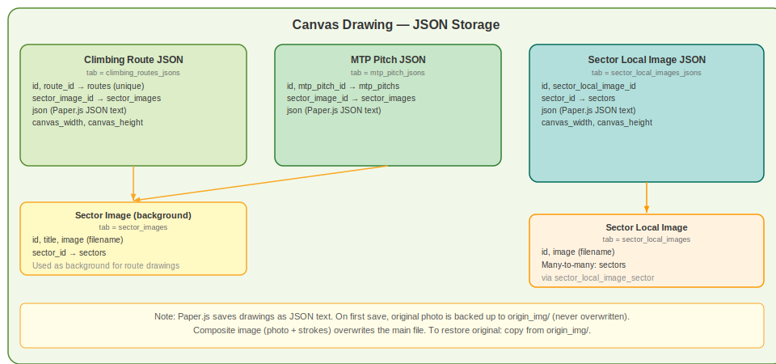

# Canvas System — Backend Documentation

Drawing data for climbing routes, MTP pitches, and sector local images is stored as Paper.js JSON in the database. Composite images (background photo + drawn strokes baked together) are saved to the filesystem.

---

## Table of Contents

- [Overview](#overview)
- [Database Models](#database-models)
- [API Endpoints](#api-endpoints)
- [Save Logic — Sector Local Images](#save-logic--sector-local-images)
- [Save Logic — Climbing Routes](#save-logic--climbing-routes)
- [Save Logic — MTP Pitches](#save-logic--mtp-pitches)
- [CanvasService — Cleanup on Delete](#canvasservice--cleanup-on-delete)
- [General Canvas Image Endpoint](#general-canvas-image-endpoint)
- [File Storage Paths](#file-storage-paths)
- [Permissions Required](#permissions-required)

---

## Overview

Three different entities can have canvas drawings:

| Entity | JSON Model | Image location |
|---|---|---|
| Sector image (shared background) | `ClimbingRoutesJson`, `MtpPitchJson` | `public/images/sector_img/` |
| Sector local image | `SectorLocalImagesJson` | `public/images/sector_local_img/` |

A single sector (background) image can have **multiple route drawings** and **multiple pitch drawings** layered on top of it. Each is stored separately and displayed as reference when editing another.

A sector **local** image has one drawing per sector (the `(sector_local_image_id, sector_id)` pair is unique).

---

## Database Models



### `ClimbingRoutesJson`

**Table:** `climbing_routes_jsons`

| Column | Type | Description |
|---|---|---|
| `id` | PK | |
| `route_id` | FK → `routes` | The climbing route this drawing belongs to |
| `sector_image_id` | FK → `sector_images` | Background image |
| `json` | text | Paper.js JSON string |
| `canvas_width` | int | Canvas width at save time (px) |
| `canvas_height` | int | Canvas height at save time (px) |

### `MtpPitchJson`

**Table:** `mtp_pitch_jsons`

| Column | Type | Description |
|---|---|---|
| `id` | PK | |
| `mtp_pitch_id` | FK → `mtp_pitches` | The pitch this drawing belongs to |
| `sector_image_id` | FK → `sector_images` | Background image |
| `json` | text | Paper.js JSON string |

### `SectorLocalImagesJson`

**Table:** `sector_local_images_jsons`

| Column | Type | Description |
|---|---|---|
| `id` | PK | |
| `sector_local_image_id` | FK → `sector_local_images` | The local image |
| `sector_id` | FK → `sectors` | Which sector's route is drawn |
| `json` | text | Paper.js JSON string |
| `canvas_width` | int | Canvas width at save time |
| `canvas_height` | int | Canvas height at save time |

**Unique constraint:** `(sector_local_image_id, sector_id)` — one drawing per route per image.

---

## API Endpoints

### Sector Local Images Canvas

All under `POST /api/set_sector/set_sector_local_images/`

| Method | URI | Controller | Permission |
|---|---|---|---|
| POST | `save_canvas_data/{image_id}` | `SectorLocalImagesController@save_canvas_data` | `sector_local_image › edit` |
| GET | `get_layouts/{id}` | `SectorLocalImagesController@get_layouts` | `sector_local_image › show` |
| GET | `get_layout/{layout_id}` | `SectorLocalImagesController@get_layout` | `sector_local_image › show` |
| GET | `get_layouts_for_sector/{sector_local_image_id}` | `SectorLocalImagesController@get_layouts_for_sector` | `sector_local_image › show` |

### Route JSON (Climbing Routes Canvas)

Under `/api/set_route_json/`

| Method | URI | Controller | Permission |
|---|---|---|---|
| POST | `add_route_json` | `RouteJsonController@add_route_json` | `route › add` |
| POST | `edit_route_json/{route_id}` | `RouteJsonController@edit_route_json` | `route › edit` |
| DELETE | `del_route_json/{route_id}` | `RouteJsonController@del_route_json` | `route › edit` |

### MTP Pitch Canvas

Under `/api/set_mtp_pitch/`

| Method | URI | Controller | Permission |
|---|---|---|---|
| POST | `save_pitch_drawing/{pitch_id}` | `MTPPitchController@save_pitch_drawing` | `mtp_pitch › edit` |
| DELETE | `del_pitch_drawing/{pitch_id}` | `MTPPitchController@del_pitch_drawing` | `mtp_pitch › edit` |
| GET | `get_pitch_jsons_for_sector_image` | `MTPPitchController@get_pitch_jsons_for_sector_image` | `mtp_pitch › show` |

### General Canvas Image Save

| Method | URI | Controller | Auth |
|---|---|---|---|
| POST | `/api/save-canvas-image` | `CanvasController@saveImage` | None |

---

## Save Logic — Sector Local Images

**Controller:** `App\Http\Controllers\Api\User\Admin\Guide\SectorLocalImagesController@save_canvas_data`

**Request payload:**

```json
{
    "canvasData":    "<Paper.js JSON>",
    "sectorId":      123,
    "edited_image":  "data:image/jpeg;base64,...",
    "canvas_width":  800,
    "canvas_height": 600
}
```

**What it does:**

1. Validates `sectorId` is present.
2. Looks up the `sector_local_image` record to get the filename.
3. If `edited_image` is provided:
   - Creates `origin_img/` subdirectory if missing.
   - **Backs up the clean original** once to `images/sector_local_img/origin_img/{filename}`. Never overwrites the backup.
   - Strips the `data:image/...;base64,` prefix and writes the decoded bytes over the main file at `images/sector_local_img/{filename}`.
4. Upserts `SectorLocalImagesJson` on `(sector_local_image_id, sector_id)` with the JSON and dimensions.
5. Returns `layout_id` and `has_original` flag.

**Image backup rule:** The first time canvas data is saved for an image, the untouched photo is backed up. Subsequent saves overwrite the main file with the composite (photo + strokes). The backup is never overwritten so the original can always be restored.

---

## Save Logic — Climbing Routes

**Controller:** `App\Http\Controllers\Api\User\Admin\Guide\RouteJsonController`

`edit_route_json` is a static helper called from `RouteController` during route add/edit. It does an upsert by `route_id`:

- If no existing record → calls `add_route_json` (inserts).
- If record exists → validates and updates.

**Fields stored:** `route_id`, `sector_image_id`, `json`.

**Note:** `add_route_json` validates `route_id` is unique in `climbing_routes_jsons`. The `edit_route_json` validator does NOT check uniqueness (to allow updates).

---

## Save Logic — MTP Pitches

**Controller:** `App\Http\Controllers\Api\User\Admin\Guide\MTPPitchController@save_pitch_drawing`

1. Looks up the `mtp_pitch` record.
2. Saves the composite image to `images/sector_img/` (same path as the original sector image, overwriting with strokes).
3. Upserts `MtpPitchJson` on `mtp_pitch_id`: updates if exists, creates if not.

The `get_pitch_jsons_for_sector_image` endpoint returns JSON strings for all pitches on a given sector image EXCEPT the one currently being edited (used to show other pitches as reference layers in the editor).

---

## CanvasService — Cleanup on Delete

**File:** `app/Services/CanvasService.php`

**Always call these before deleting an image record** to prevent orphaned JSON rows.

```php
use App\Services\CanvasService;

// Before deleting a sector_images row:
CanvasService::deleteSectorImageCanvasData($sectorImageId);
// → deletes from climbing_routes_jsons WHERE sector_image_id = $sectorImageId
// → deletes from mtp_pitch_jsons WHERE sector_image_id = $sectorImageId

// Before deleting a sector_local_images row:
CanvasService::deleteSectorLocalImageCanvasData($sectorLocalImageId);
// → deletes from sector_local_images_jsons WHERE sector_local_image_id = $sectorLocalImageId
```

---

## General Canvas Image Endpoint

`POST /api/save-canvas-image` — `CanvasController@saveImage`

- **Auth:** None required (public).
- **Purpose:** General-purpose PNG save, not tied to any specific entity.
- **Input:** `image` (file upload, PNG/JPG/JPEG/GIF, max 10MB).
- **Output:** `{ success, filename, path }` — path is under `storage/images/`.
- **Used by:** Any canvas component that needs to upload a raw image without entity context.

---

## File Storage Paths

| Context | Path |
|---|---|
| Sector images (shared background) | `public/images/sector_img/` |
| Sector local images | `public/images/sector_local_img/` |
| Sector local images — originals backup | `public/images/sector_local_img/origin_img/` |
| Product option combination images | `public/images/product_option_img/` |
| General canvas saves | `storage/images/` (via Laravel Storage) |

---

## Permissions Required

| Subject | Action | Used For |
|---|---|---|
| `sector_local_image` | `show` | Load layouts / JSON |
| `sector_local_image` | `edit` | Save canvas data |
| `route` | `show` | Load route JSON |
| `route` | `add` | Create route JSON record |
| `route` | `edit` | Update / delete route JSON |
| `mtp_pitch` | `show` | Load pitch JSON |
| `mtp_pitch` | `edit` | Save / delete pitch drawing |

---

[Back to Backend docs](API.md)
