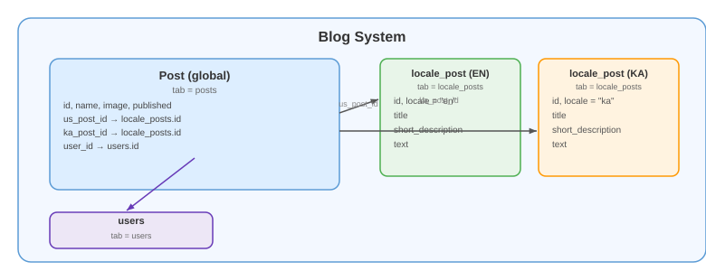

# Climbing Blog — blog.climbing.ge

Blog and news platform for the climbing community: trip reports, gear reviews, technique articles, and news.

---

## Overview

**Subdomain:** `blog.climbing.ge`  
**Root Component:** `resources/js/components/blog/BlogMainComponent.vue`  
**Router:** `resources/js/routes/BlogRoutes.js`  
**API base URL:** `/api/` (blog routes)

### Pages

| Path | Component | Description |
|---|---|---|
| `/` | `IndexPage.vue` | Post list with featured post |
| `/post/:url_title` | `pages/PostPage.vue` | Individual post |
| `/news/:url_title` | `pages/NewsPage.vue` | Individual news article |
| `/about` | `AboutUsPage.vue` | About the blog |

---

## Frontend Components

### `IndexPage.vue` — Post List

**`resources/js/components/blog/pages/IndexPage.vue`**

Displays all posts and news. Loads via `GET /api/get_post/get_all_posts_and_news_for_blog/{locale}`.

**Features:**
- Featured/latest post displayed prominently
- Post cards grid
- `PostModal` for quick preview without leaving the page

### `PostPage.vue` / `NewsPage.vue`

Full post/news page. Loads single post via:
- `GET /api/get_post/get_post/{url_title}`
- `GET /api/get_post/get_news/{url_title}`

Content rendered from Quill editor HTML output.

### `PostModal.vue` — Quick Preview Modal

**`resources/js/components/blog/items/Modals/PostModal.vue`**

Receives the full `post` object as a prop (passed from `IndexPage`). Displays title and content without a separate API call.

```html
<PostModal :show="modal_visible" :post="selected_post" @close="modal_visible = false" />
```

---

## Backend API

### Public Routes — `routes/api/get_blog_routes.php` (`Api\Blog\PostController`, no auth)

| Method | Path | Controller method | Notes |
|---|---|---|---|
| GET | `/api/get_post/get_all_posts_and_news_for_blog/{locale}` | `get_all_posts_and_news_for_blog` | **Merges two entirely different sources**, not one `posts` table with a `type` column: `Blog\Post` rows (type `post`) + `Guide\Article` rows where `category = 'news'` (type `news`, reused from the [Guidebook](GUIDBOOK.md) article system, localized via `ArticlesService::get_locale_article_use_locale`). Hand-rolled array pagination (`per_page`, default 5) after merging + sorting both sources by `created_at` in PHP — not a DB-level query. See [Known Issues](#known-issues) for two real bugs found here. |
| GET | `/api/get_post/get_post/{url_title}` | `get_post` | Single post by slug. See [Known Issues](#known-issues) — no `published` filter. |
| GET | `/api/get_post/get_news/{url_title}` | `get_news` | Single news article — correctly filters `published = 1`, unlike `get_post` above |
| GET | `/api/get_post/get_all_posts` | `get_all_posts` | Despite the doc's previous "(admin)" label, this route carries **no auth middleware and no permission check** — it's a fully public endpoint, just not linked from the public blog UI. Returns every post (published or not) with title/url_title/published flag/created_at + the full author `User` object. |

### Admin Routes — `routes/api/admin/set_blog_routes.php` (`Api\User\Admin\Blog\PostController`)

Requires `auth:sanctum` + `banned` middleware (group-level) plus a per-method `PermissionService::authorize('post', $action)` check — permission subject is `post`.

| Method | Path | Action required |
|---|---|---|
| GET | `/api/set_post/get_editing_post/{id}` | `post › show` |
| POST | `/api/set_post/add_post` | `post › add` |
| POST | `/api/set_post/edit_post/{id}` | `post › edit` |
| DELETE | `/api/set_post/del_post/{id}` | `post › del` |
| POST | `/api/set_post/bulk_delete` | `post › del` |
| POST | `/api/set_post/bulk_publish` | `post › edit` |
| POST | `/api/set_post/bulk_unpublish` | `post › edit` |

**Controllers:** `App\Http\Controllers\Api\Blog\PostController` (public) / `App\Http\Controllers\Api\User\Admin\Blog\PostController` (admin) — two separate classes, not one shared controller as the previous version of this doc implied.

---

## Database



Same **global + locale split** pattern used by the [Guidebook article system](GUIDBOOK.md#articles-global--locale) — a blog post is not one flat row, it's a `posts` row (metadata) joined to one `locale_posts` row per language (the actual title/text). There is no `type` or `locale` column on `posts` itself — "type" (`post` vs `news`) only exists as a runtime-computed label in the merged listing response above, and "locale" is a query-time choice of which `locale_posts` row to join, not stored data.

**`posts`** (`App\Models\Blog\Post`, `database/migrations/2025_09_11_145838_create_posts_table.php`):

| Column | Type | Notes |
|---|---|---|
| `id` | bigint | PK |
| `url_title` | string, nullable | URL slug |
| `published` | int, nullable | Visibility flag |
| `image` | string, nullable | Cover image path |
| `us_post_id` | bigint FK → `locale_posts.id` | English content |
| `ka_post_id` | bigint FK → `locale_posts.id` | Georgian content |
| `user_id` | bigint FK → `users.id` | Author |
| `created_at` / `updated_at` | timestamps | |

**`locale_posts`** (`App\Models\Blog\Locale_post`, `database/migrations/2025_09_11_145837_create_locale_posts_table.php`) — one row per language per post:

| Column | Type | Notes |
|---|---|---|
| `id` | bigint | PK |
| `locale` | string, nullable | e.g. `en` / `ka` |
| `title` | string, nullable | |
| `short_description` | string, nullable | Used for card/listing previews |
| `text` | text, nullable | Quill HTML content — this is what the frontend renders as `content` |

**Relations**: `Post::us_post()` / `Post::ka_post()` — `belongsTo(Locale_post::class, 'us_post_id' | 'ka_post_id')`.

---

## Admin Panel (user.climbing.ge)

Posts are managed in the user panel under the Blog section. The admin uses the standard `tabsComponent` table listing with add/edit/delete + bulk publish/unpublish/delete actions (see route table above). The edit form uses the Quill rich-text editor (`big_editor` global component).

---

## Known Issues

Found during a documentation audit (September 2026) — noted here rather than silently fixed, since fixing code was out of scope for this pass. **#1 is the same class of bug documented in [SECURITY_AND_PITFALLS.md](BACKEND/SECURITY_AND_PITFALLS.md) for the Guide comments/reviews system this session, just not caught in that sweep because Blog wasn't in its scope.**

1. **The full `User` model (email, phone number, country, city, …) is attached to every public blog response, unrestricted, and the frontend never uses it.** `get_all_posts_and_news_for_blog`, `get_post`, and `get_all_posts` all do `User::find($post->user_id)` / `User::where(...)->first()` with no column restriction and put the result straight into the JSON response as `'user'`. A grep of every `.vue` file under `resources/js/components/blog/` found **zero** reads of `.user.*` anywhere in the frontend — this data is sent to every anonymous visitor of the blog for no reason at all. Same fix pattern as the rest of the audit: `User::select(['id','name','surname','image'])` (or drop the field entirely, since nothing renders it).
2. **`get_post` (single post by URL) has no `published` filter**, unlike `get_news` right next to it in the same controller, which correctly filters `published = 1`. A draft/unpublished post's individual page is publicly viewable by anyone who knows or guesses its `url_title`.
3. **`get_all_posts_and_news_for_blog` (the public blog homepage listing) also has no `published` filter on the posts side** (`Post::latest()->get()`, no `where`) — unpublished draft posts appear in the public listing feed alongside real published posts. The news half of the same merge *does* correctly filter `published = 1` on `Article`, so this looks like an oversight specific to the post branch rather than an intentional design choice.
4. **`get_all_posts` has no auth or permission gate at all**, despite being consumed only by the admin dashboard in practice — it's reachable by anyone, returning every post's publish status and full author `User` object. Should be moved under `routes/api/admin/set_blog_routes.php` with a `PermissionService::authorize('post', 'show')` check, consistent with how the rest of the admin API is gated.

---

[Go back](../README.md)
