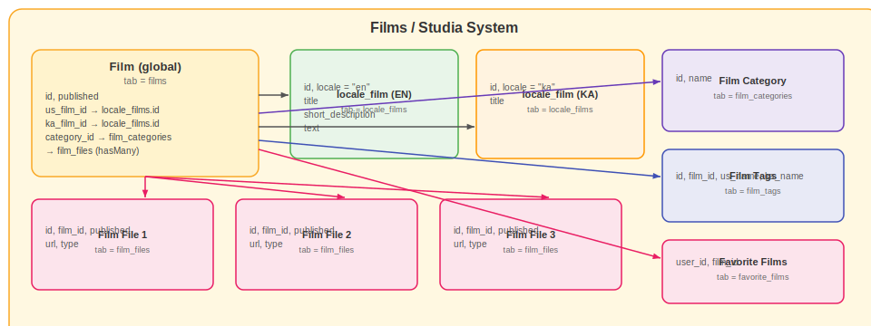

# Climbing Films — films.climbing.ge

Climbing films portal for discovering and sharing climbing-related videos and documentaries.

---

## Overview

**Subdomain:** `films.climbing.ge`  
**Root Component:** `resources/js/components/films/StudiaComponent.vue`  
**Router:** `resources/js/routes/FilmsRoutes.js`  
**API base URL:** `/api/film/`

---

## Frontend Pages

| Path | Description |
|---|---|
| `/` | Film index — categories and featured films |
| `/films/:category` | Films by category |
| `/film/:url_title` | Individual film page |
| `/favorites` | User's saved films |

---

## Backend API

### Public Routes — `routes/api/get_films_routes.php`

| Method | Path | Description |
|---|---|---|
| GET | `/api/film/get_films/{locale}` | Films for current locale |
| GET | `/api/film/get_film/{locale}/{url_title}` | Single film detail |
| GET | `/api/film/get_same_films/{category_id}/{film_id}/{locale}` | Related films |
| GET | `/api/film/get_films_categories/{locale}` | All categories |
| GET | `/api/film/films_search/{locale}` | Search films |
| GET | `/api/film/top_films/{top_film_type}/{locale}` | Top/featured films |
| GET | `/api/film/get_faworite_film_list` | User's favorite films |

### Admin Routes — `routes/api/admin/set_films_routes.php`

Requires `auth:sanctum` + `banned` middleware.

| Method | Path | Description |
|---|---|---|
| GET/POST/PUT/DELETE | `/api/films` | Film CRUD (RESTful resource) |
| GET/POST/PUT/DELETE | `/api/film_tags` | Tag CRUD (RESTful resource) |

**Controllers:**  
- `App\Http\Controllers\Api\Films\FilmsController`  
- `App\Http\Controllers\Api\Films\FilmTagsController`

---

## Database

**Films table** (`films`):

| Column | Type | Notes |
|---|---|---|
| `id` | int | PK |
| `url_title` | string | URL slug |
| `title` | string | Film title |
| `description` | text | Description |
| `video_url` | string | Embed URL |
| `image` | string | Cover image |
| `category_id` | int | FK → film_categories |
| `locale` | string | `en` or `ka` |
| `published` | boolean | Visibility |
| `views` | int | View counter |

---

[Go back](../README.md)
