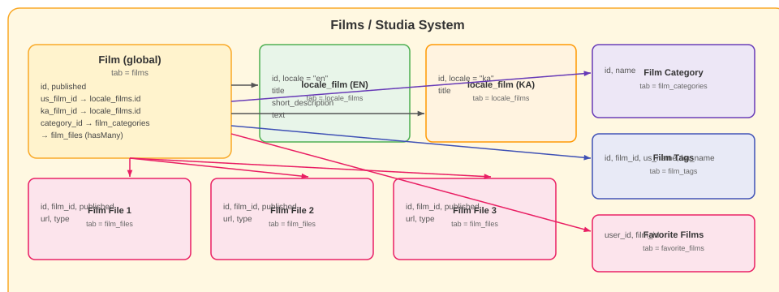

# Climbing Films — films.climbing.ge

Climbing films portal for discovering and sharing climbing-related videos and documentaries.

---

## Overview

**Subdomain:** `films.climbing.ge`  
**Root Component:** `resources/js/components/films/StudiaComponent.vue`  
**Router:** `resources/js/routes/FilmsRoutes.js`  
**API base URL:** `/api/film/`  
**Controllers:** `App\Http\Controllers\Api\Films\FilmsController` / `FilmTagsController` (public), `App\Http\Controllers\Api\User\Admin\Films\FilmsController` (namespaced "Admin" but see [Favoriting](#favoriting-not-actually-admin-only) below — favoriting a film is a plain logged-in-user action routed through this namespace, not a moderation feature)

---

## Frontend Pages

| Path | Description |
|---|---|
| `/` | Film index — categories and featured films |
| `/films/:category` | Films by category |
| `/film/:url_title` | Individual film page |
| `/favorites` | User's saved films |

---

## Backend API

### Public Routes — `routes/api/get_films_routes.php`

| Method | Path | Controller : Method | Notes |
|---|---|---|---|
| GET | `/api/films` | `FilmsController@index` | Raw `Film::get()` — **no `public`/`published` filter**, returns every film regardless of visibility. Restricted to `->only(['index'])` (the other RESTful verbs aren't implemented — see [Known Issues](#known-issues)). |
| GET | `/api/film/get_films/{locale}` | `FilmsController@get_films` | Films for current locale, filtered to `public = 1` |
| GET | `/api/film/get_film/{locale}/{url_title}` | `FilmsController@get_film` | Single film detail, `public = 1` only |
| GET | `/api/film/get_same_films/{category_id}/{film_id}/{locale}` | `FilmsController@get_same_films` | Related films, same category, excludes current film, limit 4 |
| GET | `/api/film/get_films_categories/{locale}` | `FilmsController@get_films_categories` | All categories — **`{locale}` is accepted but never used**; the method ignores `$request` entirely and just returns `Film_category::get()` unfiltered |
| GET | `/api/film/films_search/{locale}` | `FilmsController@films_search` | **Broken — see [Known Issues](#known-issues)**, always returns "No Details found" regardless of what's searched |
| GET | `/api/film/top_films/{top_film_type}/{locale}` | `FilmsController@get_films_top` | Only `top_film_type = get_most_liked_films` is implemented; any other value returns nothing (`null`) |
| GET | `/api/film/get_faworite_film_list` | `FilmsController@get_faworite_film_list` | Requires `auth:sanctum`. **Not the endpoint the dashboard actually calls** — see [Known Issues](#known-issues) |
| GET/POST/PUT/DELETE | `/api/film_tags` | `FilmTagsController` (`apiResource`, unrestricted) | Only `index`/`show` are actually implemented — `store`/`update`/`destroy` will 500 if ever hit (registered but dead, same pattern documented in [SECURITY_AND_PITFALLS.md](BACKEND/SECURITY_AND_PITFALLS.md)) |

### Admin Routes — `routes/api/admin/set_films_routes.php`

Requires `auth:sanctum` + `banned` middleware (group-level — most of these methods have **no additional permission check** beyond "logged in and not banned", see per-row notes).

| Method | Path | Controller : Method | Permission gate |
|---|---|---|---|
| GET | `/api/films` | `Admin\Films\FilmsController@index` | `film › show` (only route in this file with an explicit `PermissionService::authorize` call) — restricted to `->only(['index'])`, same reason as the public duplicate |
| GET | `/api/film/get_films/{locale}` etc. | Same 6 read methods as the public controller, duplicated verbatim in the admin namespace | None beyond auth:sanctum+banned |
| POST | `/api/film/add_to_faworite` | `Admin\Films\FilmsController@add_to_faworite` | None — any logged-in, non-banned user |
| DELETE | `/api/film/del_from_faworite/{film_id}` | `Admin\Films\FilmsController@del_from_faworite` | None |
| GET | `/api/film/get_faworite_film_list` | `Admin\Films\FilmsController@get_faworite_film_list` | None — this is a **second, separate implementation** of the same-named method that exists on the public controller too, and it's the one the frontend actually calls (URL mismatch, see below) |

**Admin CRUD for films/tags is not implemented at all** — neither `Admin\Films\FilmsController` nor `FilmTagsController` has `store`/`update`/`destroy` methods. `filmsAddComponent.vue`/`filmsEditComponent.vue` on the frontend are literal placeholder stub components (`
filmsAddComponent
`). This is an unfinished feature on both ends, not a regression — films appear to be seeded/managed directly in the database today.

### Favoriting — not actually "admin-only"

`add_to_faworite`/`del_from_faworite`/the admin copy of `get_faworite_film_list` live under the `Api\User\Admin\Films` namespace and its `routes/api/admin/set_films_routes.php` route file purely by historical accident — they're genuinely used by any logged-in visitor clicking the heart icon on a film page (`FilmPageComponent.vue`), not a moderation action, and (unlike `index()` in the same file) carry no `PermissionService::authorize()` check. Functionally correct today; just a misleading location if you go looking for "the favorites feature" under "admin".

---

## Database

**Films table** (`films`, see `database/migrations/*_create_films_table.php`):

| Column | Type | Notes |
|---|---|---|
| `id` | bigint | PK |
| `url_title` | string, nullable | URL slug |
| `us_film_id` | bigint FK → `locale_films.id` | English locale content |
| `ka_film_id` | bigint FK → `locale_films.id` | Georgian locale content |
| `published` | int, nullable | Visibility flag — **note the column is `published`, but most read queries (`get_films`, `get_film`, `get_same_films`, `get_films_top`) filter on a `public` attribute instead** (see [Known Issues](#known-issues) — this looks like an inconsistency between the migration and the query code, not two separate columns; `Film::$fillable` only lists `published`) |
| `image` | string, nullable | Cover image |
| `created_at` / `updated_at` | timestamps | |

Locale-specific fields (`title`, `description`, `video_url`, category, etc.) live on the related `locale_films` row via `us_film()`/`ka_film()`, not directly on `films` — the flat column list in the previous version of this doc did not reflect this join, it was describing an imagined denormalized shape.

**Relations** (`App\Models\Films\Film`):
- `files()` — `hasMany(Film_file::class)`
- `tags()` — `hasMany(Film_tag::class)`
- `us_film()` / `ka_film()` — `hasOne(Locale_film::class)`, keyed by `us_film_id`/`ka_film_id`
- `$notifyMode` — a plain PHP property (not a DB column / not Eloquent-tracked), read by `FilmObserver::updated()` to decide whether an admin save should trigger a "film updated" vs. "new film" notification, or none. Set it before calling `->save()` if you need to control that from new code; it's not persisted.

---

## Known Issues

Found during a documentation audit (September 2026) — noted here rather than silently fixed, since fixing code was out of scope for this pass:

1. **`films_search` is completely broken on the public controller.** `Api\Films\FilmsController::films_search()` references `$query` without ever assigning it from the request (`if ($query != "")`) — an undefined variable, which PHP evaluates as `null`, and `null != ""` is `false` in PHP's loose comparison. The method therefore *always* falls through to the `else` branch and returns `'No Details found. Try to search again !'`, regardless of what's actually searched — the public film search feature does not work at all. The **admin-namespaced duplicate** (`Api\User\Admin\Films\FilmsController::films_search`) has the correct fix already (`$query = $request->query ?? '';`) — porting that one line to the public controller would fix it.
2. **The dashboard's "Favorite Films" page calls a URL that doesn't exist.** `resources/js/components/user/pages/favorites/FavoriteFilmsPageComponent.vue` calls `GET /get_film/get_faworite_film_list` and `POST /get_film/del_from_faworite/{id}` — but no route is registered under a `get_film` prefix anywhere in the app (the real routes are `film/get_faworite_film_list` and `film/del_from_faworite/{id}`, singular "film", under both the public and admin route files). Every load of this dashboard page 404s. This is a plain path typo, not a guard/permission issue — the underlying controller methods work correctly when called at their real path.
3. **`get_films_categories` accepts a `{locale}` route param it never uses** — categories are returned unfiltered/untranslated regardless of what's passed. May be intentional (categories might not be localized), but the route signature implies otherwise.
4. **`film_tags` is a fully-open `apiResource`** (`store`/`update`/`destroy` registered, not implemented) — same over-registration pattern documented in [SECURITY_AND_PITFALLS.md](BACKEND/SECURITY_AND_PITFALLS.md#bug-class-3--dead--broken-routes) for other controllers this session, just not caught/fixed in that pass since it wasn't touched.
5. **`published` vs. `public`** — the migration defines a `published` column and `Film::$fillable` only lists `published`, but every read-path query in both `FilmsController` variants filters on `->where('public', '=', 1)`. Either there's an accessor/mutator aliasing one to the other that wasn't found in a quick pass, or visibility filtering is silently broken (every film would fail the `public = 1` filter if the actual column is `published`) — worth a developer checking the live DB schema directly (`DESCRIBE films;`) to confirm which column actually exists before relying on either of these code paths.

---

[Go back](../README.md)
