# Rock Climbing Guidebook — climbing.ge

**climbing.ge** is a Georgian rock climbing guidebook covering outdoor sport climbing, mountaineering, ice climbing, bouldering, and indoor facilities.

---

## Table of Contents

- [Overview](#overview)
- [Frontend Pages](#frontend-pages)
- [Backend API](#backend-api)
- [Database Structure](#database-structure)
- [Admin Panel](#admin-panel)

---

## Overview

**Subdomain:** `climbing.ge`  
**Root Component:** `resources/js/components/guide/GuideMainComponent.vue` (IndexComponent)  
**Router:** `resources/js/routes/SiteRoutes.js`

### Article Categories

| Category | Description |
|---|---|
| `outdoor` | Outdoor sport climbing spots |
| `mount_route` | Mountaineering routes |
| `ice` | Ice climbing |
| `indoor` | Indoor climbing gyms |
| `bouldering` | Bouldering areas |
| `other` | Other climbing-related content |

---

## Frontend Pages

### `IndexPageComponent.vue` — Homepage

Sections:
- Hero swiper (`SwiperComponent`)
- What We Do (`WhatWeDoComponent`)
- Topo map (from `$globalSiteData.data.map`)
- Latest news (`newsCard`, `bigNewsCard`)
- Special/featured articles (`SpecialArticleComponent`)
- Upcoming events (`EventComponent`)
- Other articles (`OtherArticlesComponent`)
- Tech tips (`TechtipsComponent`)
- Gallery (`IndexGalleryComponent`)
- Team members slider
- Products slider (cross-promo from shop)

### List Pages (`pages/lists/`)

Each category has a dedicated list page:
- `OutdoorListComponent.vue` — sport climbing regions
- `MountaineeringListComponent.vue` — mountaineering routes
- `IceListComponent.vue` — ice climbing
- `IndoorListComponent.vue` — indoor gyms
- `EventsListPageComponent.vue` — competitions and events

**Common pattern:**
```html
<h1 class="index_h2">Section Title</h1>
<div class="bar"><i class="fa fa-icon"></i></div>
<h3 class="article_list_short_description">Description</h3>
<!-- cards in .article_card_container -->
```

Features: region filter dropdown, grouped/list view toggle (`ViewControlsComponent`).

### Article Pages (`pages/pages/`)

- `OutdoorPageComponent.vue` — outdoor spot with sectors, routes, images, map
- `MountaineeringPageComponent.vue` — mountaineering route
- `IcePageComponent.vue` — ice climbing
- `IndoorPageComponent.vue` — indoor gym
- `EventPageComponent.vue` — event/competition detail
- `LocalBisnesPageComponent.vue` — local business

### Search

`SerchPageComponent.vue` — searches across articles, products, and films.

---

## Backend API

**File:** `routes/api/get_guide_routes.php`

### Key Public Endpoints

| Method | Path | Description |
|---|---|---|
| GET | `/api/get_article/get_locale_articles/{category}/{lang}` | Articles by category + language |
| GET | `/api/get_article/get_locale_article_on_page/{category}/{lang}/{url_title}` | Full article page data |
| GET | `/api/get_outdoor/get_filtred_outdoor_spots/{lang}/{filter_id}/{published}` | Filtered outdoor spots |
| GET | `/api/get_sector/get_sector_and_routes/{article_id}` | Sectors + routes for climbing spot |
| GET | `/api/get_route/get_route_for_modal/{route_id}` | Route detail |
| GET | `/api/get_mount_route/get_mount_routes_by_maunt/{lang}` | Mountaineering routes grouped by mountain |
| GET | `/api/get_event/get_event_on_site_list/{lang}` | Events list |
| GET | `/api/get_region/get_all_outdoor_regions` | All outdoor regions |
| GET | `/api/get_article/last_news/{lang}` | Latest news |

Full endpoint list in [BACKEND/API.md](BACKEND/API.md#guide--public).

---

## Database Structure

### Full Entity Hierarchy

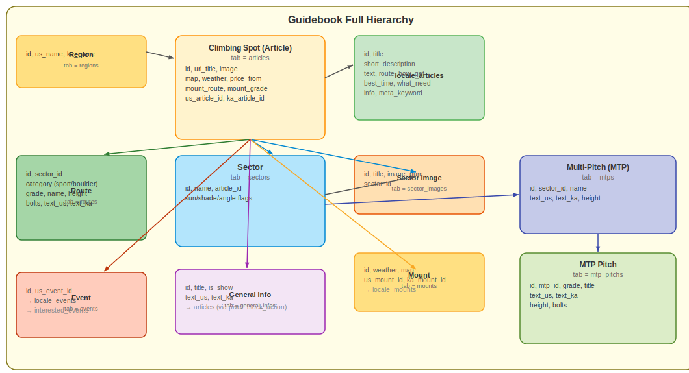

### Articles (Global + Locale)

Articles have two tables:
- `articles` — global data: published status, image, category, url_title
- `locale_articles` — locale version: title, short_description, text content per language

```
articles
├── id, category, url_title, image, published
└── locale_articles (1:many)
    └── article_id, lang, title, short_description, text
```

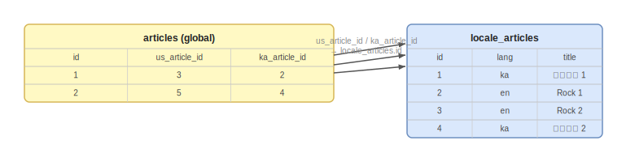

### General Info

Reusable info blocks (contact details, warnings) that can be embedded in multiple articles.

```
general_infos
└── inserted into article blocks as references
```

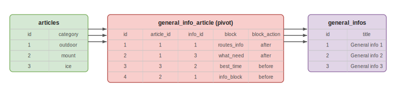

### Outdoor Climbing Spot

An outdoor climbing area is an article with `category = 'outdoor'`.

```
article (outdoor)
├── spot_rocks_images       # Overview rock images for the area
├── sector_local_images     # Sub-area images with multiple sector links
└── sectors (1:many)
    ├── sector_images       # Topo images per sector
    └── routes (1:many)     # Climbing routes
```

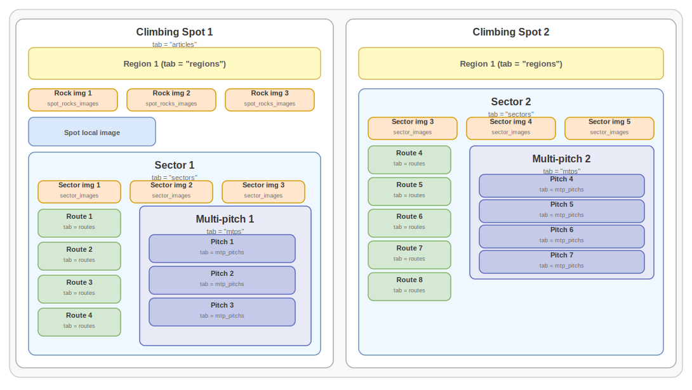  
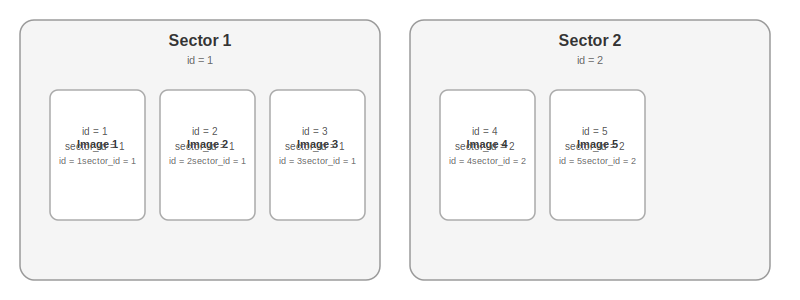  
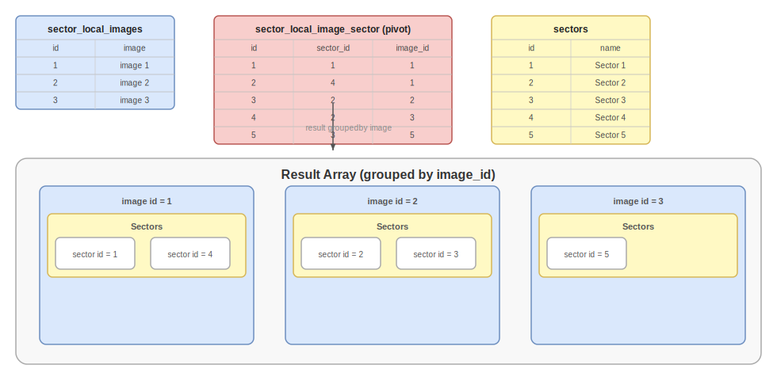

### Routes

Sport routes and bouldering share the `routes` table (different `category` value).  
Multi-pitch routes use two tables:

```
mtps (multi-pitch routes)
└── mtp_pitchs (individual pitches, ordered)
```

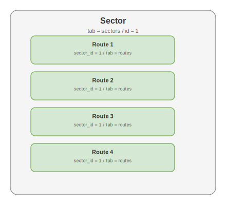  
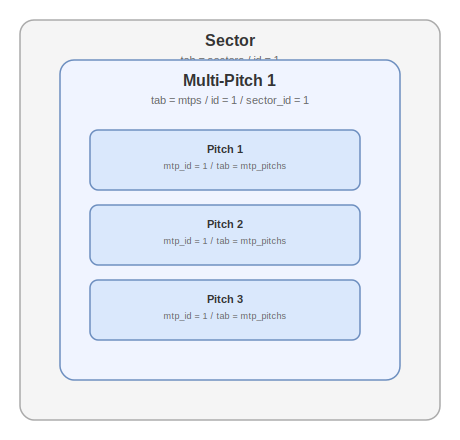

### Mountaineering Routes

```
mount_masives (mountain groups)
└── articles (mount_route category)
    └── locale_articles
```

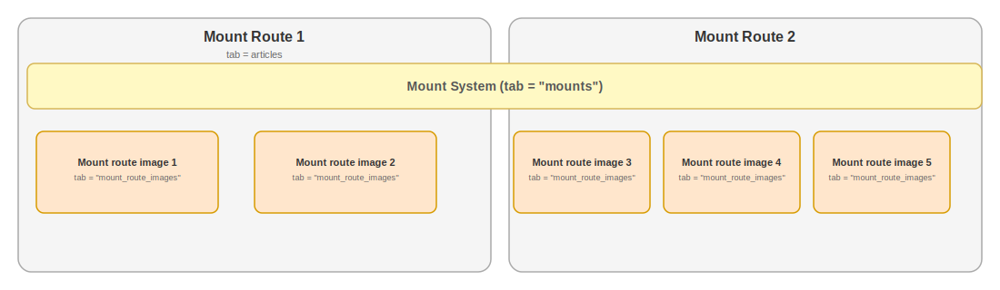

### Gallery

`galleries.image_type` values:

| Value | Used in |
|---|---|
| `header_image` | Section hero images |
| `index_gallery_image` | Homepage gallery |
| `article_image` | Article-specific gallery |

Article images linked via `gallery_image_article` pivot table.

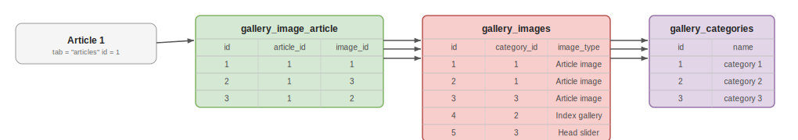

### Comments

Guests and authenticated users can comment on articles.

**Guest flow:** Name + email required → after submission, email matched against registered users → if match found, "Is it your comment?" notification sent to user's dashboard.

**Comment violations:** Any user can report a comment. Admin reviews and decides. Email notification sent.

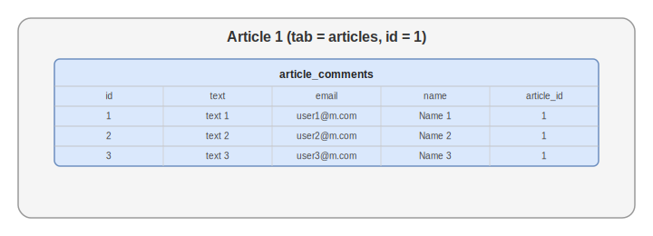  
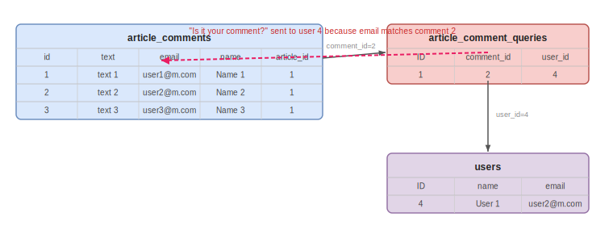  
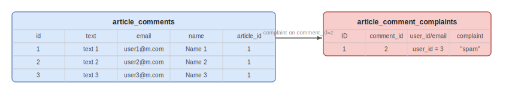

### Local Businesses

Businesses (guesthouses, shops, tour operators) linked to climbing areas.

```
suport_local_bisneses (global)
├── locale_bisneses (locale: title, description)
├── suport_local_bisnes_images (gallery)
└── article_id (linked climbing spot)
```

Visibility controlled by `published_date` — only show if still within date range.

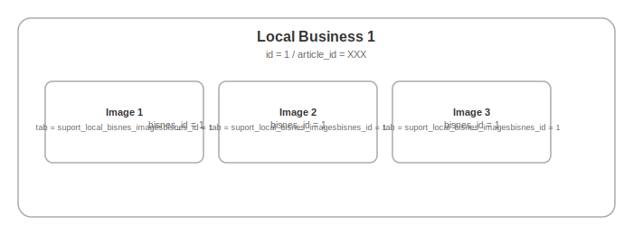

### Events

```
events (global)
└── locale_events (locale: title, description, dates)
```

Users can mark events as "interested" → stored in `interested_events`.

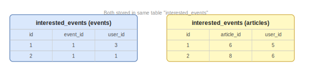

### Favorite Outdoor Areas

Registered users can save favorite climbing areas:
```
favorite_outdoor_areas
├── user_id
└── article_id (outdoor spot)
```

---

## Admin Panel

Guide content is managed at `user.climbing.ge` under the **Guide** section.

| Admin Section | Manages |
|---|---|
| **Articles** | Create/edit/delete articles by category |
| **Sectors** | Add sectors to outdoor spots |
| **Routes** | Add climbing routes to sectors |
| **Multi-pitch** | Add MTP routes and pitches |
| **Regions** | Outdoor climbing regions |
| **Mount Massifs** | Mountain group definitions |
| **Events** | Competitions and events |
| **General Info** | Reusable info blocks |
| **Sliders** | Hero image sliders |
| **Local Businesses** | Partner businesses |
| **Team Members** | Staff profiles |
| **Live Cameras** | Webcam embeds |
| **Comments** | Moderate user comments |
| **Gallery** | Manage images |

All admin tables use the `tabsComponent` pattern. See [FRONTEND/USER_PANEL_TABLE.md](FRONTEND/USER_PANEL_TABLE.md).

---

[Go back](../README.md)
