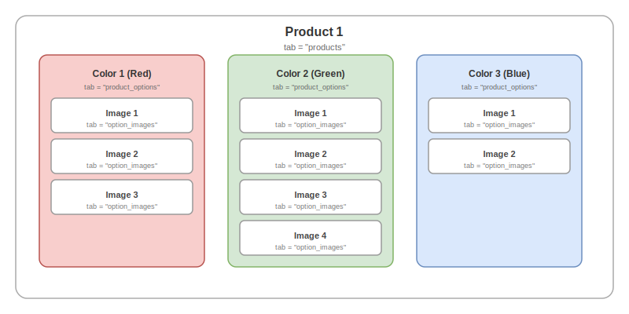
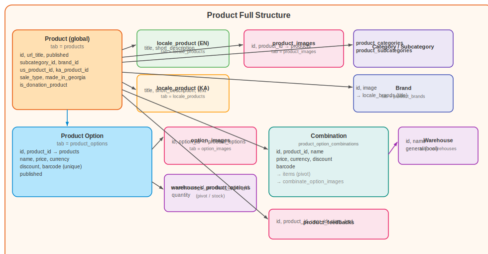
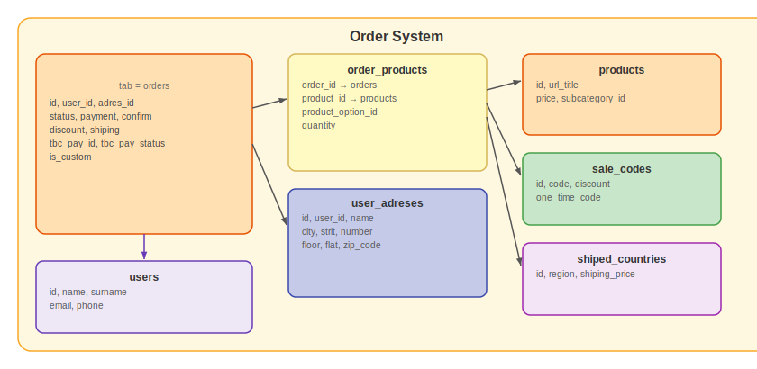
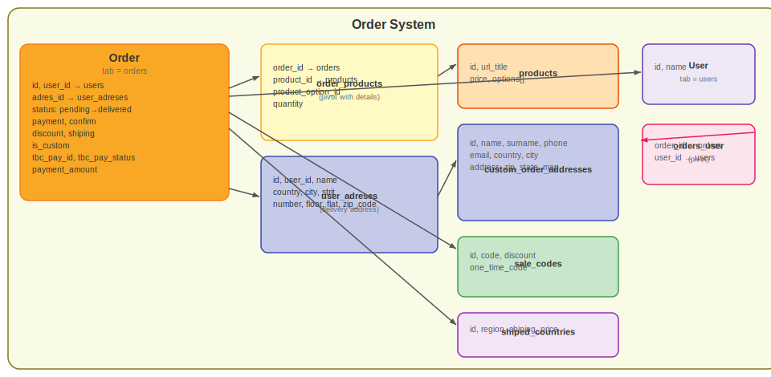
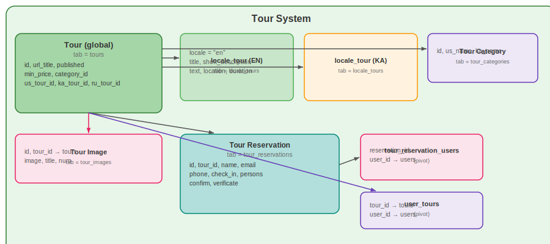
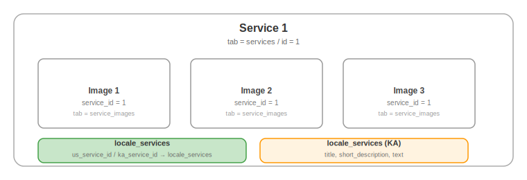
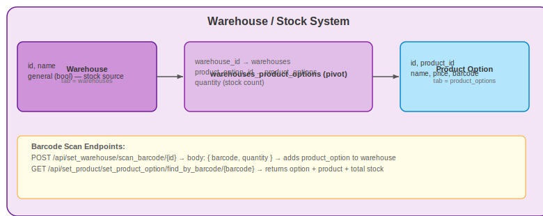

# Product Store — shop.climbing.ge

Online shop for climbing gear, apparel, guided tours, and services.

---

## Table of Contents

- [Overview](#overview)
- [Frontend Pages](#frontend-pages)
- [Backend API](#backend-api)
- [Database Structure](#database-structure)
- [Product Combinations](#product-combinations)
- [Payment](#payment)
- [Admin Panel](#admin-panel)
- [Climbing Wall Calculator (3D)](WALL_CALCULATOR_3D.md)

---

## Overview

**Subdomain:** `shop.climbing.ge`  
**Root Component:** `resources/js/components/shop/MainWrapper.vue`  
**Router:** `resources/js/routes/ShopRoutes.js`

### Sections

| Section | Description |
|---|---|
| Products | Climbing gear, apparel, equipment |
| Tours | Guided multi-day climbing tours |
| Services | Additional services (guiding, equipment rental) |
| Cart & Checkout | Cart, delivery address, payment |
| Orders | Order history and status |

---

## Frontend Pages

### `MeinPage.vue` — Shop Homepage

Displays featured products, sale items, tours, and services.

**API calls:**
- `GET /api/get_product/get_products_for_index/{lang}` — featured products
- `GET /api/get_tour/get_tours_for_index/{lang}` — featured tours
- `GET /api/get_service/get_services_for_index/{lang}` — services

### `ProductPage.vue` — Product Detail

Full product page: images, description, options (size/color), price, add to cart, reviews.

**API calls:**
- `GET /api/get_product/get_local_product_in_page/{lang}/{url_title}`
- `GET /api/get_product/get_product_options/{product_id}`
- `GET /api/get_product/get_product_feedback/get_product_feedbacks/{product_id}`

### `CartPage.vue` — Shopping Cart

Cart management: update quantities, remove items, apply sale code, see shipping estimate.

**API:** `GET/POST/PUT/DELETE /api/cart`

### `CheckoutPage.vue` — Checkout

Delivery address selection/entry, order summary, payment via Flitt gateway.

### `SearchPage.vue` — Product Search

Full-text product search with price filter and category filter.

---

## Backend API

Full endpoint list in [BACKEND/API.md](BACKEND/API.md#shop--public).

### Key Public Endpoints

| Method | Path | Description |
|---|---|---|
| GET | `/api/get_product/get_local_products/{lang}` | All products |
| GET | `/api/get_product/get_local_product_in_page/{lang}/{url_title}` | Product detail |
| GET | `/api/get_product/get_product_options/{product_id}` | Options (size/color) |
| GET | `/api/get_product/get_product_price_interval` | Price range |
| GET | `/api/get_product/get_brand/get_all_brands` | Brands |
| GET | `/api/get_tour/get_tours/{lang}` | All tours |
| GET | `/api/get_tour/get_tour/{lang}/{url_title}` | Tour detail |
| POST | `/api/set_user_reservation/create_reservation/{tour_id}` | Book tour |
| GET/POST/PUT/DELETE | `/api/cart` | Cart CRUD |
| GET | `/api/get_sale_code/get_all_sale_code` | Sale codes |
| GET | `/api/get_shiped_region/get_all_shiped_regions` | Shipping regions |

---

## Database Structure

### Product

Products have a global table and locale-specific data:

```
products (global)
├── id, url_title, subcategory_id, brand_id
├── us_product_id, ka_product_id → locale_products
├── product_options (size, color, barcode, stock via warehouse)
│   └── option_images
├── product_images (general gallery)
├── product_option_combinations (bundles)
├── product_feedbacks (reviews)
└── locale_products (title, description per lang)
```




### Orders

```
orders
├── id, user_id, adres_id (→ user_adreses)
├── status (pending → shipped → delivered)
├── payment, confirm, discount, shiping
├── tbc_pay_id, tbc_pay_status
└── order_products (pivot)
    ├── product_id, product_option_id, quantity
```

Order statuses: `pending` → `processing` → `shipped` → `delivered` / `cancelled`




### Custom Orders

Manual orders created by admin for special requests. Uses `custom_orders` + `CustomOrderAddress` model.

### Shipping Regions

```
siped_countries (shipped regions)
├── name
└── price (shipping cost)
```

### Sale Codes

```
sale_codes
├── code          # Discount code string
├── discount      # Percentage or fixed amount
└── one_time_code # Boolean — single use
```

### User Delivery Addresses

```
user_adreses
├── user_id
├── name, surname, phone
├── country, city, address
└── is_default
```

### Tours

```
tours (global)
├── id, url_title, min_price, category_id
├── tour_images
├── locale_tours (en, ka, ru — title, description, location, duration)
├── tour_reservations (check_in, persons, contact)
│   └── tour_reservation_users (pivot → users)
└── user_tours (pivot → users, for booked tours)
```



### Services

```
services (global)
├── id, url_title, image, price
├── service_images
└── locale_services (1:many)
    └── service_id, lang, title, description
```



### Warehouse & Stock

```
warehouses
└── warehouses_product_options (pivot)
    ├── warehouse_id
    ├── product_option_id
    └── quantity (stock count)
```

The `general = 1` warehouse is the canonical stock source used for product option and combination stock calculations.



---

## Product Combinations

A **combination** is a bundle of two or more product options sold as a single purchasable variant with its own name, price, discount, and optional barcode. Combinations appear in the storefront variant selector alongside regular product options.

### Concept

A regular product has **options** (e.g. "Red M", "Blue L"). A combination bundles multiple options from any products into one variant:

```
Combination: "Rope + Harness Bundle"
  ├── links to: Product_option(id=5, product_id=10, name="60m Rope")
  └── links to: Product_option(id=8, product_id=14, name="M Harness")

Price:    ₾249   (overrides individual option prices)
Discount: 10%
Barcode:  GEO-BUNDLE-001
```

Stock = **minimum** across all linked options' general-warehouse quantities. If any member option runs out, the combination is out of stock.

### Database Tables

```
product_option_combinations
├── id, product_id (FK products)
├── name, price, currency
├── discount (0–100), barcode (nullable)
└── created_at, updated_at

product_option_combination_items  (pivot)
├── combination_id → product_option_combinations
└── product_option_id → product_options

combinate_product_option_images
├── id, combination_id
├── image (filename in product_option_img/)
└── title (alt text)
```

### Stock Calculation

```php
// ProductService::get_combination_stock_quantity()
// stock = min quantity across all linked options in the general warehouse
foreach ($combo->options as $option) {
    $general = $option->warehouse->where('general', 1)->first();
    $qty = $general ? (int)($general->pivot->quantity ?? 0) : 0;
    if ($qty < $min) $min = $qty;
}
```

If a linked option has no general warehouse entry its stock is treated as 0, making the whole combination out of stock.

### API Endpoints

All under `/api/set_product_combination/`, require `auth:sanctum + banned`.

| Method | URI | Description | Permission |
|---|---|---|---|
| GET | `/get_combinations/{product_id}` | List combinations for a product | `product_option › show` |
| GET | `/get_editing_combination/{id}` | Get one combination for editing | `product_option › show` |
| GET | `/search_products?query=…` | Search products (for option selection) | `product_option › show` |
| GET | `/get_product_options/{product_id}` | Get linkable options | `product_option › show` |
| POST | `/add_combination` | Create combination | `product_option › add` |
| POST | `/edit_combination/{id}` | Update combination | `product_option › edit` |
| DELETE | `/del_combination/{id}` | Delete combination + images | `product_option › del` |
| DELETE | `/del_combination_image/{image_id}` | Delete one combination image | `product_option › edit` |

**Controller:** `App\Http\Controllers\Api\User\Admin\Shop\ProductCombinationController`

**`add_combination` / `edit_combination` request** (multipart/form-data):

```
product_id   int       (add only)
data         JSON string  { name, price, currency, discount, barcode, option_ids: [5, 8] }
images[]     file uploads (optional)
```

Images are stored in `public/images/product_option_img/`.

### ProductService Integration

`ProductService::get_combination_options($product_id)` returns entries shaped identically to regular option entries, appended to the options array when building the product detail page. The only addition is:

```php
'is_combination'          => true,
'combination_option_ids'  => [5, 8],
```

### Frontend Display

The `ProductPage.vue` variant selector receives combinations mixed into `product_options`. The `is_combination: true` flag signals the frontend to:
- Display the variant as a single selectable item (no sub-options).
- Show a bundle label or icon.
- Use combination images instead of individual option images.
- Add a `combination_id` cart item instead of a regular `product_option_id`.

### Permissions Required

| Subject | Action | Used For |
|---|---|---|
| `product_option` | `show` | List / view combinations |
| `product_option` | `add` | Create combination |
| `product_option` | `edit` | Edit combination or delete an image |
| `product_option` | `del` | Delete combination |

---

## Payment

**Gateway:** Flitt

Payment flow:
1. Checkout form → `POST /api/set_donation/create` or order create endpoint
2. Redirect to Flitt payment page
3. Flitt POSTs callback to `/api/set_donation/callback`
4. Order status updated on success

**Environment variables:**
```env
FLITT_MERCHANT_ID=...
FLITT_SECRET_KEY=...
FLITT_API_VERSION=1.0
```

---

## Admin Panel

Shop content managed at `user.climbing.ge` under the **Shop** section.

| Admin Section | Manages |
|---|---|
| **Products** | Full product CRUD + images + options |
| **Categories** | Product category tree |
| **Brands** | Brand list |
| **Orders** | View and update order status |
| **Custom Orders** | Manually created orders |
| **Tours** | Guided tour listings + images |
| **Tour Categories** | Tour taxonomy |
| **Reservations** | Tour booking management |
| **Services** | Service listings |
| **Warehouses** | Stock/inventory tracking |
| **Sale Codes** | Discount code generation |
| **Shipping Regions** | Shipping zone prices |

All admin tables use the `tabsComponent` pattern. See [FRONTEND/USER_PANEL_TABLE.md](FRONTEND/USER_PANEL_TABLE.md).

---

## Barcode Scan System

Product options support a barcode field that enables physical scanner devices to be used in the warehouse and when creating custom orders.

### How It Works

Each product option can have a unique barcode (EAN, QR, or any string). Barcode scanners behave like keyboards — they type the code and press Enter — so all scan inputs work with any USB/Bluetooth scanner out of the box.

### Setting a Barcode on a Product Option

In the admin panel: **Shop → Products → (product) → Options → Add / Edit option**

A **Barcode** text field is shown below the Discount field. Type or scan the code directly into the field and save.

- The barcode is stored in `product_options.barcode` (nullable, unique).
- If left empty, the option simply has no barcode and cannot be targeted by the scan endpoints.

### Warehouse Scan

In the admin panel: **Shop → Warehouses → (warehouse)**

Click **"Scan Barcode"** to open the scan panel. It contains:
- A barcode input (auto-focused) — scan or type, then press Enter or click **Add**
- A quantity field (default 1)
- Inline success / error feedback

**Behaviour:**
- If the barcode matches a known product option → the option is added to the warehouse (or its quantity incremented) and the list refreshes automatically.
- If the barcode is unknown → an error message is shown inline. The input stays focused for the next scan.
- The manual **"Add Product Option"** dropdown is still available alongside the scanner.

**API endpoint:**
```
POST /api/set_warehouse/scan_barcode/{warehouse_id}
Body: { barcode: string, quantity?: number }
Returns: { success, product_option, message }
Errors: 404 if barcode not found, 422 if barcode missing
Permission: warehouse › edit
```

### Custom Order Scan

In the admin panel: **Shop → Custom Orders → Add Custom Order**

Click **"Scan Barcode"** (above the product list) to open the scan panel. Scanning a barcode immediately appends the product option to the order's product list with quantity 1 and the correct stock information pre-filled.

- The scanned item appears as a fully populated row (product, option, max quantity from warehouse stock).
- The row can be edited manually after scanning (change quantity, remove item).
- If the barcode is unknown → an error is shown inline and the input stays focused.
- Manual **"Add Product"** dropdowns remain available alongside the scanner.

**API endpoint:**
```
GET /api/set_product/set_product_option/find_by_barcode/{barcode}
Returns: { option, product, quantity (total warehouse stock), image }
Errors: 404 if barcode not found
Permission: product_option › show
```

### Database

```
product_options
└── barcode  (string, nullable, unique)  -- added by migration 2026_06_23_174849
```

---

[Go back](../README.md)
