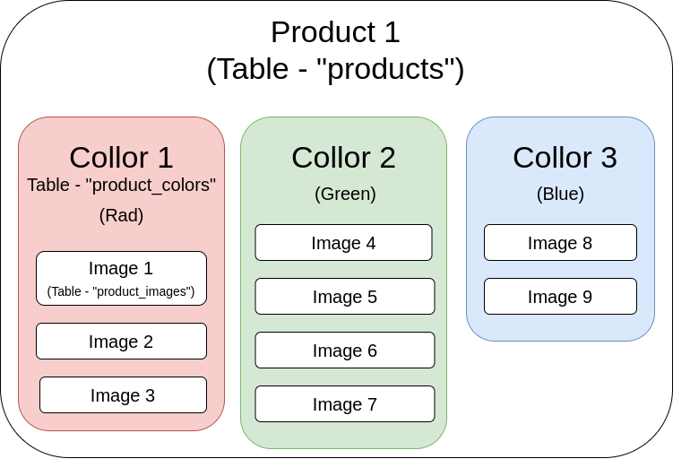
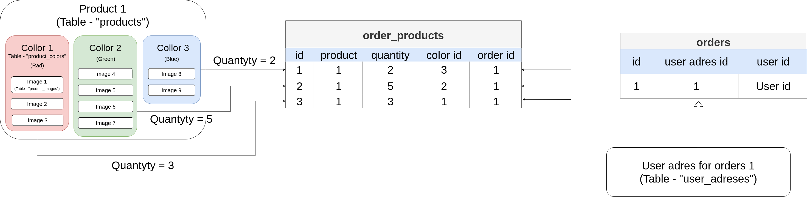
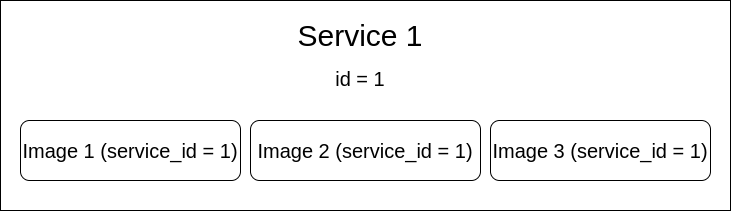

# Product Store — shop.climbing.ge

Online shop for climbing gear, apparel, guided tours, and services.

---

## Table of Contents

- [Overview](#overview)
- [Frontend Pages](#frontend-pages)
- [Backend API](#backend-api)
- [Database Structure](#database-structure)
- [Payment](#payment)
- [Admin Panel](#admin-panel)

---

## Overview

**Subdomain:** `shop.climbing.ge`  
**Root Component:** `resources/js/components/shop/MainWrapper.vue`  
**Router:** `resources/js/routes/ShopRoutes.js`

### Sections

| Section | Description |
|---|---|
| Products | Climbing gear, apparel, equipment |
| Tours | Guided multi-day climbing tours |
| Services | Additional services (guiding, equipment rental) |
| Cart & Checkout | Cart, delivery address, payment |
| Orders | Order history and status |

---

## Frontend Pages

### `MeinPage.vue` — Shop Homepage

Displays featured products, sale items, tours, and services.

**API calls:**
- `GET /api/get_product/get_products_for_index/{lang}` — featured products
- `GET /api/get_tour/get_tours_for_index/{lang}` — featured tours
- `GET /api/get_service/get_services_for_index/{lang}` — services

### `ProductPage.vue` — Product Detail

Full product page: images, description, options (size/color), price, add to cart, reviews.

**API calls:**
- `GET /api/get_product/get_local_product_in_page/{lang}/{url_title}`
- `GET /api/get_product/get_product_options/{product_id}`
- `GET /api/get_product/get_product_feedback/get_product_feedbacks/{product_id}`

### `CartPage.vue` — Shopping Cart

Cart management: update quantities, remove items, apply sale code, see shipping estimate.

**API:** `GET/POST/PUT/DELETE /api/cart`

### `CheckoutPage.vue` — Checkout

Delivery address selection/entry, order summary, payment via Flitt gateway.

### `SearchPage.vue` — Product Search

Full-text product search with price filter and category filter.

---

## Backend API

Full endpoint list in [BACKEND/API.md](BACKEND/API.md#shop--public).

### Key Public Endpoints

| Method | Path | Description |
|---|---|---|
| GET | `/api/get_product/get_local_products/{lang}` | All products |
| GET | `/api/get_product/get_local_product_in_page/{lang}/{url_title}` | Product detail |
| GET | `/api/get_product/get_product_options/{product_id}` | Options (size/color) |
| GET | `/api/get_product/get_product_price_interval` | Price range |
| GET | `/api/get_product/get_brand/get_all_brands` | Brands |
| GET | `/api/get_tour/get_tours/{lang}` | All tours |
| GET | `/api/get_tour/get_tour/{lang}/{url_title}` | Tour detail |
| POST | `/api/set_user_reservation/create_reservation/{tour_id}` | Book tour |
| GET/POST/PUT/DELETE | `/api/cart` | Cart CRUD |
| GET | `/api/get_sale_code/get_all_sale_code` | Sale codes |
| GET | `/api/get_shiped_region/get_all_shiped_regions` | Shipping regions |

---

## Database Structure

### Product

Products have a global table and locale-specific data:

```
products (global)
├── id, url_title, image, category_id, subcategory_id
├── brand_id, price, sale_price, published
├── product_options (size, color, stock)
│   └── product_option_values
├── product_images (gallery)
├── product_feedbacks (reviews)
└── locale_products (1:many)
    └── product_id, lang, title, description
```



### Orders

```
orders
├── id, user_id, status, total_price
├── address (delivery details)
├── sale_code_id (discount applied)
└── order_products (1:many)
    ├── product_id, quantity, price
    └── product_option_id
```

Order statuses: `pending` → `processing` → `shipped` → `delivered` / `cancelled`



### Custom Orders

Manual orders created by admin for special requests. Uses `custom_orders` + `CustomOrderAddress` model.

### Shipping Regions

```
siped_countries (shipped regions)
├── name
└── price (shipping cost)
```

### Sale Codes

```
sale_codes
├── code          # Discount code string
├── discount      # Percentage or fixed amount
└── one_time_code # Boolean — single use
```

### User Delivery Addresses

```
user_adreses
├── user_id
├── name, surname, phone
├── country, city, address
└── is_default
```

### Tours

```
tours (global)
├── id, url_title, image, category_id, price, duration
├── tour_images
└── locale_tours (1:many)
    └── tour_id, lang, title, description, program
```

### Services

```
services (global)
├── id, url_title, image, price
├── service_images
└── locale_services (1:many)
    └── service_id, lang, title, description
```



---

## Payment

**Gateway:** Flitt

Payment flow:
1. Checkout form → `POST /api/set_donation/create` or order create endpoint
2. Redirect to Flitt payment page
3. Flitt POSTs callback to `/api/set_donation/callback`
4. Order status updated on success

**Environment variables:**
```env
FLITT_MERCHANT_ID=...
FLITT_SECRET_KEY=...
FLITT_API_VERSION=1.0
```

---

## Admin Panel

Shop content managed at `user.climbing.ge` under the **Shop** section.

| Admin Section | Manages |
|---|---|
| **Products** | Full product CRUD + images + options |
| **Categories** | Product category tree |
| **Brands** | Brand list |
| **Orders** | View and update order status |
| **Custom Orders** | Manually created orders |
| **Tours** | Guided tour listings + images |
| **Tour Categories** | Tour taxonomy |
| **Reservations** | Tour booking management |
| **Services** | Service listings |
| **Warehouses** | Stock/inventory tracking |
| **Sale Codes** | Discount code generation |
| **Shipping Regions** | Shipping zone prices |

All admin tables use the `tabsComponent` pattern. See [FRONTEND/USER_PANEL_TABLE.md](FRONTEND/USER_PANEL_TABLE.md).

---

[Go back](../README.md)
