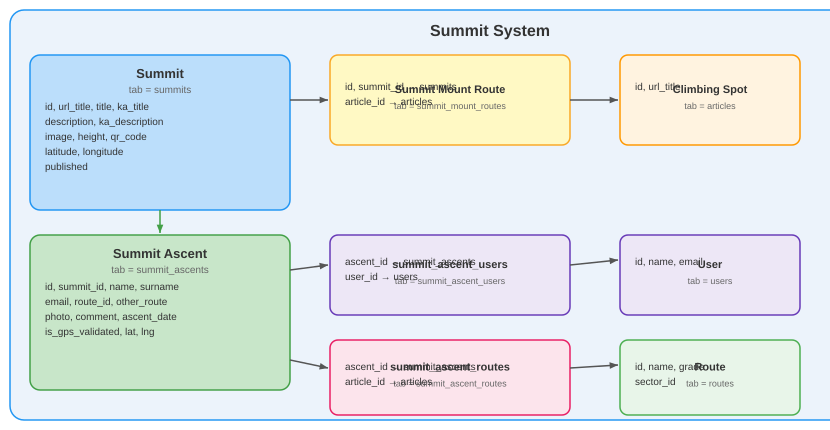

# Summit Ascent Tracker — summit.climbing.ge

QR-code-based system for recording and sharing mountain summit ascents. Climbers reach a summit, scan the QR code installed there, fill in their details, and their ascent is permanently logged.

---

## Table of Contents

- [Overview](#overview)
- [Frontend Pages](#frontend-pages)
- [Backend API — Public](#backend-api--public)
- [Backend API — Admin](#backend-api--admin)
- [Database Models](#database-models)
- [Admin Panel](#admin-panel)
- [QR Code System](#qr-code-system)
- [Ascent Flow](#ascent-flow)

---

## Overview

**Subdomain:** `summit.climbing.ge`  
**Root Component:** `resources/js/components/summit/SummitMainComponent.vue`  
**Router:** `resources/js/routes/SummitRouter.js`  
**API base URL:** `/api/summit/`

### Page Routes

| Path | Component | Description |
|---|---|---|
| `/` | `IndexPage.vue` | Home — scan QR or browse summits |
| `/about_us` | `AboutUsPage.vue` | About the platform |
| `/summits/list` | `lists/SummitListPage.vue` | All published summits |
| `/summit/:url_title` | `pages/SummitPage.vue` | Summit detail + ascent list |
| `/summits/map` | `SummitMapPage.vue` | Summit map |
| `/make_ascent/:id` | `MakeSummitAscentPage.vue` | Submit ascent form |
| `/terms_of_use` | `TermsOfUsePage.vue` | Terms of use |
| `/search` | `SearchPageComponent.vue` | Summit search results |

All pages follow the **guide-style layout**: `div.h-recent-work > div.container` with `h1.index_h2`, `div.bar > i.fa`, and `h3.article_list_short_description` section headers.

---

## Frontend Pages

### `IndexPage.vue` — Home / QR Scanner

**`resources/js/components/summit/pages/IndexPage.vue`**

Landing page. On **mobile**: shows a Scan QR button. On **desktop**: shows a message with a Browse Summits link.

**Computed:**
```javascript
isMobile  // detects by user-agent, screen width < 768, or touch events
```

**Methods:**
```javascript
scanQR()                    // activates Html5QrcodeScanner overlay
initScanner()               // configures and renders the scanner
onScanSuccess(decodedText)  // extracts path from URL, calls $router.push()
onScanError()               // silently ignores "no QR in frame" errors
closeScanner()              // clears scanner instance, hides overlay
```

**Dependencies:** `html5-qrcode` npm package

---

### `lists/SummitListPage.vue` — Public Summit List

**`resources/js/components/summit/pages/lists/SummitListPage.vue`**

All published summits displayed as guide-style cards (`.food.col-md-4 > .portfolio-img.view.view-first`). Each card contains an inline SVG mountain illustration unique per summit.

**API:** `GET /api/summit/list`

**Card features:**
- Night-sky SVG mountain with crescent moon and snow cap
- Gradient ID keyed by `summit.id` to avoid SVG conflicts
- Height rendered as SVG text
- Hover overlay → link to summit detail
- "Details" → `/summit/:url_title`
- "Ascent" → `/make_ascent/:id`

---

### `pages/SummitPage.vue` — Summit Detail

**`resources/js/components/summit/pages/pages/SummitPage.vue`**

Full summit detail page with info panel, ascent table, and QR sidebar.

**API calls:**
- `GET /api/summit/show/:url_title` — summit data (with region)
- `GET /api/summit/ascents/:url_title` — public ascent list

**Data displayed:**
- Title, Georgian title, height badge, region, coordinates
- Description text
- Record My Ascent CTA button
- Ascent table: climber name, date, route (clickable external link to guide), GPS badge, expandable comment

**Methods:**
```javascript
fetchSummit()               // loads summit, then triggers fetchAscents()
fetchAscents()              // loads public ascents for this summit
formatDate(d)               // formats to 'en-GB' locale string
guideRouteUrl(articleUrl)   // builds: {base}/outdoor/{articleUrl}
toggleComment(id)           // expands/collapses comment row in table
```

**QR sidebar:** `qrcode-vue` component displaying `ascentUrl`:
```javascript
ascentUrl  // computed: MIX_APP_SSH + MIX_SUMMIT_URL + /make_ascent/:id
```

---

### `MakeSummitAscentPage.vue` — Ascent-Form Redirector (not the form itself)

**`resources/js/components/summit/pages/MakeSummitAscentPage.vue`**

Despite the name (and despite being the QR code's actual target URL, `/make_ascent/:id`), this is **not** the ascent form — it's a thin redirector. On mount, it fetches `GET summit/list` (the public list endpoint), finds the summit whose `id` matches the route param client-side, and immediately `router.replace`s to `/summit/{url_title}?make_ascent=:id` (or back to `/summits/list` if the id doesn't resolve to a summit, e.g. because it's unpublished or was deleted). Nothing is rendered here but a loading spinner.

The **actual form** is `MakeAscentModal.vue` (`resources/js/components/summit/items/Modals/MakeAscentModal.vue`), opened by `pages/SummitPage.vue` whenever a `make_ascent` query param is present on the URL — i.e. the real flow is *always* "land on the summit detail page with the modal open," never a dedicated route.

**API:** `POST /api/summit/ascent/:summit_id` — see the full request shape and server-side validation notes under [Backend API — Public](#backend-api--public).

**Modal flow:**
1. Browser geolocation (`navigator.geolocation.getCurrentPosition`) is requested first; if granted, the modal shows the live distance from the summit's fixed coordinates and whether it's within the 20m GPS-validation threshold (client-side preview of the same Haversine check the server independently re-runs — the client's claim is never trusted, only informational).
2. Form fields: name + surname (required if not logged in), email (optional), a route `<select>` sourced from `GET /api/summit/routes/:id` (populates `article_id`) with a "not listed" fallback revealing a free-text `other_route` input, comment, and a photo file input with `capture="environment"` (opens the device camera directly on mobile).
3. reCAPTCHA v3 is loaded dynamically (`grecaptcha` script tag injected at runtime, not bundled) if a site key is configured — matching the server's `ReCaptchaV3Service::isConfigured()` gate.
4. On submit, the modal's `form.article_id`/`form.other_route` are set mutually exclusively based on whether the "other route" fallback is active, matching the server's XOR expectation on `SummitAscentRoute`.

---

### `AboutUsPage.vue`

Static informational page. Three feature blocks: Explore Summits, QR Registration, Climber Community.

### `SummitMapPage.vue`

Placeholder page — map implementation pending.

---

## Backend API — Public

**File:** `routes/api/summit_public_routes.php`  
**Controller:** `App\Http\Controllers\Api\Summit\SummitPublicController`  
**Prefix:** `/api/summit`

There is **no `region` concept anywhere in this feature** despite what older revisions of this doc claimed — summits group under `mounts` (`Summit::mount_id` → `App\Models\Guide\Mount`, the same mountaineering-groups model used by the guide subdomain's mount-route articles), not a separate `Region` model. `region()`/`mount_route_id` don't exist on the `Summit` model at all.

| Method | Path | Controller method | Description |
|---|---|---|---|
| GET | `/list` | `index` | Published (`published=1`) summits, alphabetical, minimal fields (see below) |
| GET | `/list_by_mount/{lang}` | `list_by_mount` | Published summits grouped by their `Mount`, each group carrying the mount's localized title/description/map — used to render the summit list nested under mountain sections; `{lang}` is `ka` or anything else → `us` |
| GET | `/list_filtered/{mount_id}` | `list_filtered_by_mount` | Published summits belonging to one mount |
| GET | `/show/{url_title}` | `show` | Single summit. `whereIn('published', [1, 2])` — note **2 also renders**, not just 1 (see note below) |
| GET | `/routes/{id}` | `get_routes_for_summit` | Guide-route articles linked to this summit via the `summit_mount_routes` pivot |
| GET | `/ascents/{url_title}` | `get_ascents` | Public ascent list for a summit (no email) |
| POST | `/ascent/{summit_id}` | `submit_ascent` | Submit a new ascent — works for both guests and logged-in users |
| GET | `/my_ascents` | `my_ascents` | **Requires `auth:sanctum`.** The current user's own ascents across all summits — a *different*, separately-implemented endpoint from the "User Ascent Management" one further down (`get_user_ascents/get_all_my_ascents`); the two return different shapes and live in different controllers (`Api\Summit\SummitPublicController` vs `Api\User\SummitController`). Neither is a duplicate route registration — both exist and both work — but a developer adding a "my ascents" UI should be aware there are two independent implementations to pick from. |

**`published` is an integer with 3 states** (`0`/`1`/`2`), not a boolean. `list()`/`list_by_mount()`/`list_filtered_by_mount()` only show `published=1`. `show()` and `get_ascents()` additionally allow `published=2` (a summit reachable by direct/QR-code URL — e.g. shared for review or via a physical QR plate already installed — without appearing in the public list yet). There is no comment in the code spelling out what `2` semantically means beyond "renders on `show()`/`get_ascents()` but not `list()`" — treat it as "unlisted but directly reachable."

### Response: `GET /api/summit/list` (and `list_by_mount` / `list_filtered_by_mount`, same per-summit shape)

```json
[
  {
    "id": 1,
    "title": "Mount Kazbek",
    "url_title": "mount-kazbek",
    "height": 5047,
    "latitude": 42.6993,
    "longitude": 44.5183,
    "image": "images/summit_img/kazbek.jpg"
  }
]
```

Deliberately minimal — no `description`/`ka_title`/`qr_code`/`published` on the list endpoints (those only appear on `show()`).

### Response: `GET /api/summit/show/{url_title}`

```json
{
  "id": 1,
  "title": "Mount Kazbek",
  "url_title": "mount-kazbek",
  "description": "The highest mountain in Georgia...",
  "image": "images/summit_img/kazbek.jpg",
  "height": 5047,
  "latitude": 42.6993,
  "longitude": 44.5183,
  "qr_code": "https://summit.climbing.ge/make_ascent/1"
}
```

No `ka_title`/`ka_description` in the response despite both existing as columns — the frontend detail page currently only ever renders the English fields from this endpoint (worth checking before assuming Georgian summit detail pages are localized end-to-end).

### Response: `GET /api/summit/ascents/{url_title}`

```json
{
  "summit": { "id": 1, "title": "Mount Kazbek" },
  "ascents": [
    {
      "id": 12,
      "name": "John",
      "surname": "Doe",
      "user_id": 4,
      "comment": "Amazing sunrise!",
      "photo": null,
      "is_gps_validated": true,
      "ascent_date": "2024-06-15",
      "ascent_time": "06:42",
      "route_name": "North Face Normal Route",
      "route_grade": "4A",
      "route_article_url": "mountaineering/mount-kazbek-normal-route"
    }
  ]
}
```

`email` is intentionally omitted from the public response. `user_id` is the id of the first linked `SummitAscentUser` row if the ascent was matched to a registered account (used by the frontend to link the climber's name to their [Climber Profile](CLIMBER_PROFILE.md)), otherwise `null`. `route_article_url` is only populated if the linked article is itself public (`published` in `[1,2]`) — it's a full path (`{category-segment}/{url_title}`) built from a hardcoded `category → URL segment` lookup table on the controller (`SummitPublicController::ARTICLE_CATEGORY_PATHS`), matching the guide subdomain's actual routing (`outdoor`, `indoor`, `ice`, `mountaineering` for `mount_route` category, etc.) — if a new article category is ever added to the guide, this map needs a matching entry or ascent route links to that category will silently render as `null`.

### Request: `POST /api/summit/ascent/{summit_id}`

Dual-flow — works for guests and logged-in users. If a valid Sanctum Bearer token is sent, `name`/`surname`/`email` are taken from the authenticated user's own account (request fields for those are ignored/optional); otherwise `name`/`surname` are required from the request body and `email` is optional.

```json
{
  "name": "John",
  "surname": "Doe",
  "email": "john@example.com",
  "article_id": 42,
  "other_route": "",
  "comment": "Great climb!",
  "user_latitude": 42.6993,
  "user_longitude": 44.5183,
  "recaptcha_token": "..."
}
```

Notably **not** client-submitted, despite what an earlier version of this doc implied:

- **`is_gps_validated` is computed server-side**, never trusted from the client. The controller runs a Haversine great-circle distance between the submitted `user_latitude`/`user_longitude` and the summit's own stored `latitude`/`longitude`, and sets `is_gps_validated = true` only if the climber was within **20 meters** of the summit. A request that includes `is_gps_validated: true` directly is simply ignored — the field isn't even in the validation rules.
- **`ascent_date`/`ascent_time` are always `now()`** (server clock) — not client-submitted at all, so there's no way to backdate an ascent through this endpoint.
- **`photo`** is a real file upload (`multipart/form-data`, `image|max:10240` = 10MB), stored via `ImageControllService::image_upload()` under `images/summit_ascents_img/`.
- **`article_id`** (not "route selection" against the guide `Route` model directly, despite `SummitAscent` still having a legacy `route_id`/`route()` relation to `App\Models\Guide\Route` in its fillable/relations — that column is never actually written by `submit_ascent()` and appears to be dead/superseded) links the ascent to a guide-subdomain `Article` (validated `exists:articles,id`). If instead `other_route` (free text) is filled, a `SummitAscentRoute` row is still created but with `article_id = null`. The frontend's "route selection" dropdown described further down populates `article_id`.
- **reCAPTCHA v3**: if `App\Services\ReCaptchaV3Service::isConfigured()` (i.e. the relevant `GOOGLE_CAPTCHA_V3_*` env vars are set for this flow — see [AUTH.md](AUTH.md)), a `recaptcha_token` is required and verified server-side (`verifySmart()`) before anything is saved; the request is rejected with 422 if it fails. If not configured, no reCAPTCHA check happens at all (dev/staging default).

**User matching** (creates a `SummitAscentUser` row linking the ascent to an account): a logged-in submitter is linked directly by their authenticated user id; a guest submitter is linked only if their submitted `email` matches an existing `users.email` — a guest with no email, or an email that matches no account, gets a fully anonymous ascent with no `SummitAscentUser` row at all (not retroactively claimable later the way [guest article comments/donations](AUTH.md) are, since `GuestDataLinkingService::link_all()` at registration time does cover summit ascents by email — so a guest ascent submitted with a matching future-registration email *does* get linked once that email registers).

---

## Backend API — Admin

**File:** `routes/api/admin/set_summit_routes.php`  
**Controller:** `App\Http\Controllers\Api\User\Admin\Summit\SummitController`  
**Middleware:** `auth:sanctum`, `banned`  
**Permission subject:** `summit` (`show`/`add`/`edit`/`del` actions, `PermissionService::authorize('summit', ...)` called at the top of every mutating method — same pattern as every other admin controller, see CLAUDE.md's [Permission System](../CLAUDE.md#permission-system))

| Method | Path | Controller Method | Description |
|---|---|---|---|
| GET | `/api/get_summit_admin/index` | `index` | All summits (full admin data, any `published` state) |
| GET | `/api/get_summit_admin/get_mounts_list` | `get_mounts_list` | Mounts for the "which mountain does this summit belong to" dropdown |
| GET | `/api/get_summit_admin/get_mount_routes` | `get_mount_routes` | Guide-route articles, for linking a summit to routes |
| GET | `/api/get_summit_admin/get_summit_mount_routes/{summit_id}` | `get_summit_mount_routes` | Routes already linked to one summit |
| GET | `/api/get_summit_admin/get_article_summit_relation/{article_id}` | `get_article_summit_relation` | Reverse lookup: which summit(s) a given guide article is linked to |
| GET | `/api/get_summit_admin/get_ascents/{id}` | `get_ascents` | Ascents for one summit |
| GET | `/api/get_summit_admin/get_all_ascents` | `get_all_ascents` | All ascents across every summit, with full data (incl. email) |
| GET | `/api/get_summit_admin/get_summits_list` | `get_summits_list` | Lightweight summit list, for dropdowns elsewhere in the admin panel |
| GET | `/api/get_summit_admin/export_laser_plate/{id}` | `export_laser_plate` | Export a print-ready file for the physical QR plate (see [QR Code System](#qr-code-system)) |
| POST | `/api/set_summit/store` | `store` | Create summit. Requires `summit › add` |
| POST | `/api/set_summit/update/{id}` | `update` | Update summit. Requires `summit › edit` |
| DELETE | `/api/set_summit/destroy/{id}` | `destroy` | Delete summit. Requires `summit › del` |
| POST | `/api/set_summit/save_qr/{id}` | `save_qr` | Save QR URL to DB |
| POST | `/api/set_summit/update_coordinates/{id}` | `update_coordinates` | Update GPS lat/lng |
| POST | `/api/set_summit/add_mount_route_relation` | `add_mount_route_relation` | Link summit to a guide-route article (creates a `summit_mount_routes` row) |
| DELETE | `/api/set_summit/remove_mount_route_relation/{id}` | `remove_mount_route_relation` | Remove one summit↔route link |
| POST | `/api/set_summit/update_ascent/{id}` | `update_ascent` | Admin edit of one ascent |
| DELETE | `/api/set_summit/delete_ascent/{id}` | `delete_ascent` | Admin delete of one ascent |
| POST | `/api/set_summit/bulk_delete` | `bulk_delete` | Bulk-delete summits |
| POST | `/api/set_summit/bulk_publish` / `bulk_unpublish` | `bulk_publish` / `bulk_unpublish` | Bulk set `published` |
| POST | `/api/set_summit/bulk_delete_ascents` | `bulk_delete_ascents` | Bulk-delete ascents |

### Store / Update Validation

```
title          required|string|max:255           (update: sometimes|required)
ka_title       nullable|string|max:255
description    nullable|string
ka_description nullable|string
height         nullable|integer|min:0
latitude       nullable|numeric|between:-90,90
longitude      nullable|numeric|between:-180,180
mount_id       nullable|integer|exists:mounts,id  (NOT mount_route_id/articles — see note above)
published      nullable|integer|in:0,1,2
url_title      update only: nullable|string|max:255|unique:summits,url_title,{id}
```

`url_title` is auto-generated on **create** via `URLTitleService::get_url_title($title)`, with a `_1`, `_2`, … numeric suffix appended (not a hyphen) on collision. On **update**, the existing `url_title` is left untouched by default — it's only regenerated if the request explicitly sends `is_change_url_title: true` (in which case it's rebuilt from the current/new title), or overwritten verbatim if the request sends a manual `url_title` value directly. Simply changing `title` on an update does **not** silently change the URL.

`notify_mode` (request field, not persisted as a DB column) controls `SummitObserver`'s post-save notification behavior — read into the real (non-Eloquent) PHP property `Summit::$notifyMode` right before `update()` is called:

| `notify_mode` value | Effect (only when the summit was already `published=1` before *and* after this save — a genuinely new publish, i.e. `published` flips `0/2 → 1`, always notifies regardless of this field) |
|---|---|
| `none` (default) | No notification sent for an edit to an already-published summit |
| `update` | Sends an "updated" notification (`NotificationDispatchService::notifyContentUpdated`) to whoever already follows/was notified about this summit |
| `new` | Re-sends the "new content" notification (`NotificationDispatchService::notifyNewContent`) as if it were freshly published — for a substantial enough edit that it's worth re-announcing |

### User Ascent Management

**Controller:** `App\Http\Controllers\Api\User\SummitController`  
**Middleware:** `auth:sanctum` + `banned` (the group at the bottom of `routes/api/admin/set_user_routes.php`, namespace `Api\User` — a separate, narrower group from the main `Api\User\Admin\User` admin block above it in the same file, but still fully auth-gated)  
**Note:** independent from the public `GET /api/summit/my_ascents` endpoint documented above (`SummitPublicController::my_ascents`) — same underlying data, two separately-maintained implementations with different response shapes. This one is the one actually used by the `user.climbing.ge` dashboard's "My Ascents" page; the other exists for/is used by the summit subdomain itself.

| Method | Path | Description |
|---|---|---|
| GET | `/api/get_user_ascents/get_all_my_ascents` | All ascents submitted by the current user, including `email`, `article_id`, `other_route`, `user_latitude`/`user_longitude` — the full row, unlike the public listing |
| POST | `/api/get_user_ascents/update_ascent/{id}` | Edit own ascent's `comment` and route (`article_id` or free-text `other_route`) — ownership checked via `auth()->user()->ascents()->find($id)`, so it 404s rather than leaks another user's ascent if the id doesn't belong to you |
| DELETE | `/api/get_user_ascents/del_ascent/{id}` | Delete own ascent |
| POST | `/api/get_user_ascents/bulk_delete` | Delete several of your own ascents at once (`{ids: [...]}`) |

---

## Database Models



### `Summit` (`app/Models/Summit/Summit.php`) — table: `summits`

| Column | Type | Notes |
|---|---|---|
| `id` | int | PK |
| `title` | string | English title |
| `ka_title` | string\|null | Georgian title |
| `url_title` | string | Unique URL slug |
| `description` | text\|null | English description |
| `ka_description` | text\|null | Georgian description |
| `height` | int\|null | Metres |
| `latitude` | float\|null | GPS |
| `longitude` | float\|null | GPS |
| `mount_id` | int\|null | → `mounts` (`App\Models\Guide\Mount`) — **there is no `region_id`/`Region` relation on this model**, despite an older version of this doc claiming one |
| `qr_code` | string\|null | Full QR URL, set once via `save_qr` |
| `published` | int | `0`/`1`/`2` — see the note under [Backend API — Public](#backend-api--public) for what `2` means |
| `image` | string\|null | Image path |

Also carries a real (non-persisted) PHP property `public $notifyMode = 'none'` — deliberately not an Eloquent attribute (so it's never picked up by `getDirty()`/written to the DB), read by `SummitObserver::updated()` to decide the post-save notification behavior; see the `notify_mode` table under [Store / Update Validation](#store--update-validation).

**Relationships:** `mount()` `BelongsTo(Mount)`, `mountRoutes()` `HasMany(SummitMountRoute)` (the summit↔guide-route-article link table, see below), `mountRouteArticles()` `HasManyThrough(Article, SummitMountRoute)` (convenience accessor straight to the linked `Article` rows, skipping the pivot), `ascents()` `HasMany(SummitAscent)`

---

### `SummitAscent` (`app/Models/Summit/SummitAscent.php`) — table: `summit_ascents`

| Column | Type | Notes |
|---|---|---|
| `id` | int | PK |
| `summit_id` | int | → `summits` |
| `name` | string | Climber first name |
| `surname` | string | Climber last name |
| `email` | string\|null | Contact email — used for guest→account matching, see [Request: POST /api/summit/ascent/{summit_id}](#request-post-apisummitascentsummit_id) |
| `route_id` | int\|null | → `routes` (`App\Models\Guide\Route`) via the `route()` relation — **legacy/effectively dead**: `submit_ascent()` never actually writes this column; the real route-linking mechanism is `SummitAscentRoute` below |
| `other_route` | string\|null | Fillable but, like `route_id`, not actually populated by `submit_ascent()` — the real free-text route name lives on `SummitAscentRoute.other_route_name` instead |
| `comment` | text\|null | Notes |
| `photo` | string\|null | Photo path, under `images/summit_ascents_img/` |
| `is_gps_validated` | boolean | Computed server-side (Haversine, ≤20m from the summit), never client-trusted |
| `user_latitude` / `user_longitude` | float\|null | The climber's submitted GPS position at ascent time (distinct from `summits.latitude`/`longitude`, the summit's own fixed position) |
| `ascent_date` | date | Always `now()` at submission time, not client-submitted |
| `ascent_time` | string | Always `now()->format('H:i')` at submission time |

**Relationships:** `summit()` `BelongsTo(Summit)`, `users()` `HasMany(SummitAscentUser)` (0 or 1 rows in practice — see user-matching logic above, but modeled as hasMany not hasOne), `ascentRoutes()` `HasMany(SummitAscentRoute)` (0 or 1 rows in practice too — one ascent has at most one route entry, `submit_ascent()` only ever creates a single `SummitAscentRoute` per ascent), `route()` `BelongsTo(Route)` (see the dead-column note on `route_id` above).

---

### `SummitAscentRoute` (`app/Models/Summit/SummitAscentRoute.php`) — table: `summit_ascent_routes`

The **actual** route-taken-during-this-ascent link (not `SummitAscent.route_id`/`.other_route`, see above). Either `article_id` (→ a guide-subdomain `Article`) or `other_route_name` (free text) is set, never both in practice, mirroring the `article_id` XOR `other_route` request fields on `submit_ascent()`.

**Route → guide page URL chain:** `Article.category` is mapped through `SummitPublicController::ARTICLE_CATEGORY_PATHS` to a URL segment (`outdoor`, `indoor`, `ice`, `mountaineering` for `mount_route`, etc.), then `{segment}/{article.url_title}` is the guide-subdomain path — e.g. `mountaineering/mount-kazbek-normal-route`. Only built if the linked article's own `published` is `1` or `2`.

**Relationships:** `ascent()` `BelongsTo(SummitAscent)`, `article()` `BelongsTo(Article)`.

---

### `SummitMountRoute` (`app/Models/Summit/SummitMountRoute.php`) — table: `summit_mount_routes`

A separate pivot from `SummitAscentRoute` above — don't confuse the two. This one is **admin-curated** ("which guide routes exist on/near this summit," managed via `add_mount_route_relation`/`remove_mount_route_relation`, shown to climbers as the route-selection dropdown on the ascent form via `GET /api/summit/routes/{id}`). `SummitAscentRoute` is the **per-ascent** record of which one route a specific climber actually did. A summit can have many `SummitMountRoute` rows (the available options) and each ascent picks at most one, recorded separately.

**Relationships:** `summit()` `BelongsTo(Summit)`, `article()` `BelongsTo(Article)`.

---

### `SummitAscentUser` (`app/Models/Summit/SummitAscentUser.php`) — table: `summit_ascent_users`

The ascent↔account link created by the guest-email or logged-in-user matching logic on `submit_ascent()` (see above). **Relationships:** `ascent()` `BelongsTo(SummitAscent)`, `user()` `BelongsTo(User)`.

---

## Admin Panel

**`resources/js/components/user/pages/summits/SummitListPage.vue`**

Uses the standard admin `tabsComponent` pattern (same structure as `articleListComponent.vue`).

### Tab 1: Summits

Columns: ID, Title, KA Title, Height, Mount Route, QR ✓/✗, Published ✓/✗

Action buttons:
- **QR Code** — opens QR preview modal + Save QR button
- **Edit** — opens `SummitFormModal` pre-filled
- **Delete** — opens delete confirmation modal

The "Add Summit" button (via `tabsComponent` add_action) opens `SummitFormModal` in create mode.

### Tab 2: Ascents

Columns: ID, Name, Surname, Email, Summit, Date, Route, Grade, GPS ✓/✗, Comment

Both tabs load simultaneously on mount with `Promise.all`.

### `SummitFormModal.vue`

Add/Edit modal. Fields: Title, KA Title, Description (Quill editor), KA Description, Height, Latitude, Longitude, Region (dropdown via `get_regions`), Mount Route (dropdown via `get_mount_routes`), Published toggle.

---

## QR Code System

QR code URL format: `https://summit.climbing.ge/make_ascent/{summit_id}`

Built from env vars:
```javascript
const base = process.env.MIX_APP_SSH.replace(/\/$/, '')
           + '/' + process.env.MIX_SUMMIT_URL.replace(/^\/|\/$/g, '')
const qr_value = `${base}/make_ascent/${summit.id}`
```

**Saving QR to database:**
1. Admin opens QR modal → URL displayed + `qrcode-vue` preview
2. Admin clicks **Save QR** → `POST /api/set_summit/save_qr/:id` with `{ qr_code: url }`
3. URL persisted to `summits.qr_code`
4. Badge on summit card/list changes from "None" to "Saved"

**QR scanning (mobile):**
1. `Html5QrcodeScanner` opens device camera
2. QR decoded → URL string
3. `decodedText.replace(window.location.origin, '')` extracts path
4. `$router.push(path)` → `/make_ascent/:id`

---

## Ascent Flow

```
Climber reaches summit → scans QR code
         ↓
/make_ascent/:id loaded → MakeSummitAscentPage.vue resolves id → url_title via GET summit/list
         ↓
router.replace → /summit/:url_title?make_ascent=:id
         ↓
SummitPage.vue sees ?make_ascent → opens MakeAscentModal.vue
         ↓
Browser geolocation requested (optional, client-side distance preview only)
Form: name+surname (if guest), email (optional), route (article_id) or free-text other_route,
comment, photo (camera capture on mobile), reCAPTCHA v3 token (if configured)
         ↓
POST /api/summit/ascent/:id
  - name/surname/email overridden from the authenticated user if a Sanctum token is present
  - is_gps_validated recomputed server-side (Haversine ≤ 20m), never trusts the client
  - ascent_date/ascent_time always server clock (now()), never client-submitted
  - reCAPTCHA re-verified server-side if configured
         ↓
SummitAscent record created
SummitAscentRoute record created (article_id XOR other_route_name)
Logged-in: linked directly by user id · Guest: email matched against registered users → SummitAscentUser
(no match / no email → ascent saved fully anonymous, but still retroactively linkable if that
 email registers later, via GuestDataLinkingService::link_all() — see AUTH.md)
         ↓
Ascent visible on public SummitPage ascent table, GET /api/summit/my_ascents /
get_user_ascents/get_all_my_ascents (if linked), and the admin Ascents tab
```

---

[Go back](../README.md)
