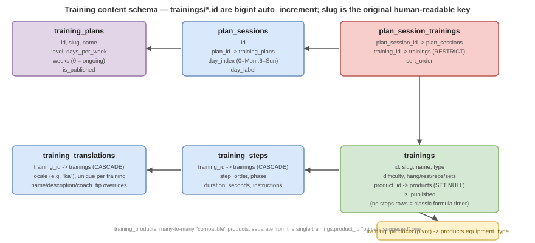

# Training Content Management

Backend content API + admin CMS for a separate companion **climbing training mobile app** (fingerboard, campus board, flexibility, strength, and endurance workouts, plus multi-day coaching plans). The app itself is not part of this repository — this is the content system it points at: an admin dashboard for authoring trainings/plans on `user.climbing.ge`, and a public JSON API the app fetches from.

---

## Table of Contents

- [Overview](#overview)
- [Database Schema](#database-schema)
- [Backend API — Public](#backend-api--public)
- [Backend API — Admin](#backend-api--admin)
- [Permissions & Roles](#permissions--roles)
- [Admin Panel](#admin-panel)
- [Content Authoring Flow](#content-authoring-flow)

---

## Overview

There is no dedicated subdomain for this feature — it's authored entirely from the `user.climbing.ge` admin dashboard (left menu → **Training**) and consumed externally by the mobile app over the public API.

**Public API base:** `/api/get_training` and `/api/get_training_plan` (no auth)
**Admin API base:** `/api/set_training` and `/api/set_training_plan` (`auth:sanctum` + `banned`, permission-gated)
**Migrations:** `database/migrations/2026_08_09_1200*` (base schema) + `2026_08_10_0900*` (shop-product linkage) + `2026_08_12_204631` (integer PK conversion) + `2026_08_15_100000` (`training_products` pivot) — full list in [Database Schema](#database-schema)
**Models:** `app/Models/Training/`
**Public controllers:** `app/Http/Controllers/Api/Training/`
**Admin controllers:** `app/Http/Controllers/Api/User/Admin/Training/`
**Admin Vue pages:** `resources/js/components/user/pages/trainings/`

### Two content types

- **Training** — a single exercise/workout (e.g. "20s Dead Hang"). Belongs to one `type` (fingerboard/campus/flexibility/strength/endurance), optionally broken into ordered `steps` for a step-by-step timer.
- **Training Plan** — a multi-day coaching program. Made of `sessions` (one per training day of the week), each session listing an ordered set of trainings to do that day.

---

## Database Schema



### `trainings`

| Column | Type | Notes |
|---|---|---|
| `id` | `bigint unsigned` auto_increment PK | Was a slug-style varchar PK; converted by `2026_08_12_204631_convert_training_ids_to_integer_pk` — the old slug string is preserved in `slug` (see below) |
| `slug` | `varchar(64)` unique | Original slug-style identifier (e.g. `dead-hang-20s`); still used as the human-readable/import-time key, but no longer the PK |
| `name` | `varchar(120)` | |
| `description` | `text`\|null | |
| `type` | enum | `fingerboard`, `campus`, `flexibility`, `strength`, `endurance` |
| `difficulty` | enum | `easy`, `medium`, `hard` — default `medium` |
| `target_muscle` | `varchar(160)`\|null | |
| `coach_tip` | `text`\|null | |
| `image_url` | `varchar(500)`\|null | Populated either by pasting a URL directly or via the admin form's cover-image upload widget (`single_image_add`), which posts a real file and gets back a URL — see [Admin Panel](#admin-panel) |
| `hang_time`, `rest_time`, `reps`, `sets`, `recover_time` | int | Legacy formula fields — **always required as a fallback** even when `steps` exist, since the app's History/Analytics and completion screen read `reps`/`sets` directly. For a step-based training, set `reps` = number of work steps and `sets` = 1 so those summaries still read sensibly. |
| `product_id` | `bigint unsigned`\|null FK | → `products.id`, `ON DELETE SET NULL` — the single "primary suggested" shop product for this training (e.g. the flagship hangboard for a fingerboard training). Nullable: most trainings (campus, strength, endurance, flexibility) need no specific product. |
| `is_published` | boolean | Public API only returns `is_published = 1` rows |

**Relationships:** `steps()` `HasMany(TrainingStep)` ordered by `step_order`, `translations()` `HasMany(TrainingTranslation)`, `product()` `BelongsTo(Product)` via `product_id`, `products()` `BelongsToMany(Product)` via `training_products` (see below)

### `training_products`

Many-to-many pivot listing every shop product *compatible* with a training (not just the one primary suggestion in `product_id`) — e.g. a fingerboard training might suggest one flagship hangboard via `product_id` but list several other hangboard models here as alternatives.

| Column | Type | Notes |
|---|---|---|
| `training_id` | FK → `trainings.id`, `ON DELETE CASCADE` | Composite PK with `product_id` |
| `product_id` | FK → `products.id`, `ON DELETE CASCADE` | |

### Product equipment typing

`products.equipment_type` (nullable enum: `fingerboard`, `campus_board`, `climbing_wall`, `system_wall`, `pull_up_bar`, `weights` — added by `2026_08_10_090100_add_equipment_type_to_products_table`) marks which shop products are climbing-training *equipment*, as opposed to ordinary gear. This is what distinguishes "trainings tied to a purchasable product" from "trainings that need no equipment" — currently only real hangboard/fingerboard products in the shop are tagged and linked this way (see `docs/BACKEND/sql-imports/t4c_inspired_training_seed.sql`); campus-board/system-wall products can be tagged and linked the same way once such a product exists in the shop.

### `training_steps`

Optional ordered step-by-step breakdown for a training. A training with no rows here just runs the classic hang/rest/reps/sets/recover formula in the app's timer.

| Column | Type | Notes |
|---|---|---|
| `training_id` | `bigint unsigned` FK | → `trainings.id`, `ON DELETE CASCADE` — remapped from the original `varchar(64)` by `2026_08_12_204631_convert_training_ids_to_integer_pk`, same as `training_translations.training_id`, `plan_translations.plan_id`, and `plan_session_trainings.training_id` |
| `step_order` | int | Unique per training |
| `phase` | enum | `prepare`, `hang`, `rest`, `recover`, `work`, `stretch` |
| `label`, `image_url`, `instructions` | | all nullable |
| `duration_seconds` | int | |

### `training_translations`

Per-locale overrides. One row per non-default locale (currently just `ka`) per training. The app reads `workout.translations[lang]` and falls back to the base `trainings` row when a locale or field is missing.

| Column | Type |
|---|---|
| `training_id` | FK → `trainings.id`, `ON DELETE CASCADE` |
| `locale` | `varchar(8)` (e.g. `ka`) — unique per training |
| `name`, `description`, `coach_tip`, `target_muscle` | nullable overrides |

### `training_plans`

| Column | Type | Notes |
|---|---|---|
| `id` | `bigint unsigned` auto_increment PK | Was a slug-style varchar PK; converted the same way as `trainings.id` (see above), old slug preserved in `slug` |
| `name`, `emoji`, `tagline`, `description`, `coach_note` | | |
| `level` | enum | `beginner`, `intermediate`, `expert`, `maintenance` |
| `days_per_week` | int | |
| `weeks` | int | `0` = ongoing / no fixed end date |
| `is_published` | boolean | |

**Relationships:** `sessions()` `HasMany(PlanSession)` ordered by `day_index`, `translations()` `HasMany(PlanTranslation)`

### `plan_translations`

Same fallback pattern as `training_translations`, for `name`, `tagline`, `description`, `coach_note`.

### `plan_sessions`

One row per training day in a plan.

| Column | Type | Notes |
|---|---|---|
| `plan_id` | FK → `training_plans.id`, `ON DELETE CASCADE` | |
| `day_index` | tinyint | `0` = Monday … `6` = Sunday, unique per plan |
| `day_label` | `varchar(40)` | Free-text label, e.g. "Monday" |

### `plan_session_trainings`

Join table: which trainings run on a given session day, and in what order.

| Column | Type | Notes |
|---|---|---|
| `plan_session_id` | FK → `plan_sessions.id`, `ON DELETE CASCADE` | |
| `training_id` | FK → `trainings.id`, `ON DELETE RESTRICT` | Deleting a training still referenced here is blocked — the admin API returns a 422 instead of failing the SQL constraint |
| `sort_order` | int | |

---

## Backend API — Public

**Files:** `routes/api/get_training_routes.php`
**Controllers:** `App\Http\Controllers\Api\Training\{TrainingController,TrainingPlanController}`
**Auth:** none — only `is_published = 1` rows are ever returned

| Method | Path | Description |
|---|---|---|
| GET | `/api/get_training/get_all_trainings?type=<type>&product_id=<id>` | All published trainings, optional `type` filter and optional `product_id` filter — **`product_id` only matches `trainings.product_id` (the single primary-suggested product), not the `training_products` many-to-many pivot** (`Api\Training\TrainingController::get_all_trainings` does a plain `where('product_id', ...)`, no `orWhereHas('products', ...)`) — a training that lists a product only as a secondary/compatible option via `training_products` will **not** appear when filtering by that product's id here |
| GET | `/api/get_training/get_training_data/{id}` | Single published training incl. `steps` + `translations` |
| GET | `/api/get_training_plan/get_all_plans` | All published plans |
| GET | `/api/get_training_plan/get_plan_data/{id}` | Single published plan incl. `sessions` (each with nested training objects) + `translations` |

### Response shape: `GET /api/get_training/get_training_data/{id}`

Field names are camelCase to match the mobile app's TypeScript models directly:

```json
{
  "id": "dead-hang-20s",
  "name": "20s Dead Hang",
  "description": "...",
  "type": "fingerboard",
  "difficulty": "medium",
  "targetMuscle": "Forearms",
  "coachTip": "Keep shoulders engaged.",
  "imageUrl": "https://.../dead-hang.jpg",
  "productId": 1,
  "productIds": [1, 4, 9],
  "hangTime": 20,
  "restTime": 10,
  "reps": 6,
  "sets": 4,
  "recoverTime": 180,
  "steps": [
    { "order": 1, "phase": "hang", "label": "Hang", "durationSeconds": 20, "imageUrl": null, "instructions": "..." }
  ],
  "translations": {
    "ka": { "name": "...", "description": "...", "coachTip": "...", "targetMuscle": "..." }
  }
}
```

`productId` is the single "primary suggested" product (`trainings.product_id`); `productIds` is the full list of compatible products from the `training_products` pivot, including the primary one.

### Response shape: `GET /api/get_training_plan/get_plan_data/{id}`

```json
{
  "id": "beginner-4-week",
  "name": "Beginner 4-Week Plan",
  "emoji": "🧗",
  "level": "beginner",
  "tagline": "...",
  "description": "...",
  "coachNote": "...",
  "daysPerWeek": 3,
  "weeks": 4,
  "isPreset": true,
  "sessions": [
    {
      "dayIndex": 0,
      "dayLabel": "Monday",
      "workouts": [ /* same shape as a single training above */ ]
    }
  ],
  "translations": { "ka": { "name": "...", "tagline": "...", "description": "...", "coachNote": "..." } }
}
```

Note: `isActive`, `startDate`, `notificationsEnabled` and similar per-device state are kept by the app in local storage — the API never stores or returns them.

---

## Backend API — Admin

**Files:** `routes/api/admin/set_training_routes.php`
**Controllers:** `App\Http\Controllers\Api\User\Admin\Training\{TrainingController,TrainingPlanController}`
**Middleware:** `auth:sanctum`, `banned`
**Auth:** every method calls `PermissionService::authorize($subject, $action)` — see [Permissions & Roles](#permissions--roles)

### Trainings

| Method | Path | Permission | Description |
|---|---|---|---|
| GET | `/api/set_training/get_all_trainings` | `training:show` | All trainings incl. unpublished, for the admin list |
| GET | `/api/set_training/get_training_data/{id}` | `training:show` | Single training incl. steps + translations (raw snake_case model, for editing) |
| GET | `/api/set_training/search_products` | `training:show` | Shop-product search for the Products tab's category→subcategory→product picker (see [Admin Panel](#admin-panel)) |
| POST | `/api/set_training/create_training` | `training:add` | Create — `multipart/form-data` when a cover image file is included |
| POST | `/api/set_training/update_training/{id}` | `training:edit` | Update |
| DELETE | `/api/set_training/del_training/{id}` | `training:del` | Delete — 422 if referenced by a plan session |
| POST | `/api/set_training/bulk_delete` | `training:del` | `{ ids: [...] }` — skips (and reports) any still in use by a plan |
| POST | `/api/set_training/bulk_publish` | `training:edit` | `{ ids: [...] }` |
| POST | `/api/set_training/bulk_unpublish` | `training:edit` | `{ ids: [...] }` |

### Training Plans

| Method | Path | Permission | Description |
|---|---|---|---|
| GET | `/api/set_training_plan/get_all_plans` | `training_plan:show` | All plans incl. unpublished |
| GET | `/api/set_training_plan/get_plan_data/{id}` | `training_plan:show` | Single plan incl. sessions + nested trainings |
| POST | `/api/set_training_plan/create_plan` | `training_plan:add` | Create |
| POST | `/api/set_training_plan/update_plan/{id}` | `training_plan:edit` | Update |
| DELETE | `/api/set_training_plan/del_plan/{id}` | `training_plan:del` | Delete (cascades sessions) |
| POST | `/api/set_training_plan/bulk_delete` | `training_plan:del` | `{ ids: [...] }` |
| POST | `/api/set_training_plan/bulk_publish` | `training_plan:edit` | `{ ids: [...] }` |
| POST | `/api/set_training_plan/bulk_unpublish` | `training_plan:edit` | `{ ids: [...] }` |

### Create/Update request body — training

```json
{
  "name": "20s Dead Hang",
  "description": "...",
  "type": "fingerboard",
  "difficulty": "medium",
  "target_muscle": "Forearms",
  "coach_tip": "...",
  "image_url": "https://...",
  "image": "<file, optional — sent as multipart/form-data instead of image_url when uploading a new cover photo>",
  "product_id": 1,
  "product_ids": [1, 4, 9],
  "hang_time": 20, "rest_time": 10, "reps": 6, "sets": 4, "recover_time": 180,
  "is_published": 1,
  "steps": [
    { "phase": "hang", "label": "Hang", "duration_seconds": 20, "image_url": null, "instructions": "..." }
  ],
  "translations": {
    "ka": { "name": "...", "description": "...", "coach_tip": "...", "target_muscle": "..." }
  }
}
```

`id` is never sent by the client — it's auto-generated server-side from `name` via `Str::slug()`, with a random 6-character suffix appended on collision. On update, `steps` and `translations` are **fully replaced** (delete-all-then-recreate) rather than diffed, so the request must always include the complete current set, not just changes. `product_ids` is likewise fully replaced via `$training->products()->sync($data['product_ids'] ?? [])` on every update — omitting it clears all compatible-product links, it does not leave them untouched. When an `image` file is present it's saved via `ImageControllService::image_upload()` and `image_url` is set from the result, overriding any `image_url` also sent in the same request.

### Create/Update request body — plan

```json
{
  "name": "Beginner 4-Week Plan",
  "emoji": "🧗", "level": "beginner", "tagline": "...", "description": "...", "coach_note": "...",
  "days_per_week": 3, "weeks": 4, "is_published": 1,
  "sessions": [
    { "day_index": 0, "day_label": "Monday", "training_ids": ["dead-hang-20s", "campus-ladders"] }
  ],
  "translations": {
    "ka": { "name": "...", "tagline": "...", "description": "...", "coach_note": "..." }
  }
}
```

Same full-replace rule applies to `sessions` (and the `plan_session_trainings` rows they generate, in `training_ids` order).

---

## Permissions & Roles

Two permission subjects, each with the standard four actions:

| Subject | Actions |
|---|---|
| `training` | `show`, `add`, `edit`, `del` |
| `training_plan` | `show`, `add`, `edit`, `del` |

Seeded by `database/migrations/2026_08_09_120700_sync_training_permissions_with_admin_role.php`, which also grants the full set to the `admin` role — following the same additive, idempotent pattern as every other `sync_*_permission_with_admin_role.php` migration in this repo (safe to re-run, `down()` only removes what it added).

A dedicated **`training_creator`** role (`database/migrations/2026_08_09_120800_create_training_creator_role.php`) is granted `show`/`add`/`edit` on both subjects — **not** `del`. This lets a trusted non-admin (e.g. a hired coach) author and edit training content without full admin access or the ability to delete anything. Assign it to a user the same way any other role is assigned, from the Users & Permissions admin page.

---

## Admin Panel

**`resources/js/components/user/pages/trainings/`**

| Component | Route | Purpose |
|---|---|---|
| `TrainingsListComponent.vue` | `/trainings` | List, search/sort/paginate, bulk publish/unpublish/delete |
| `TrainingAddComponent.vue` | `/training/add` | Create form |
| `TrainingEditComponent.vue` | `/training/edit/:id` | Edit form |
| `TrainingPlansListComponent.vue` | `/training_plans` | List, same bulk actions |
| `TrainingPlanAddComponent.vue` | `/training_plan/add` | Create form |
| `TrainingPlanEditComponent.vue` | `/training_plan/edit/:id` | Edit form |

List pages use the standard admin `tabsComponent` pattern (same shared component as every other admin list — search, sort, pagination, and bulk actions come from it for free).

Add/Edit pages are tabbed:

- **Training form (4 tabs):** Global Info (name, type, difficulty, target muscle, coach tip, image URL **or** cover-image upload via a `single_image_add` widget, hang/rest/reps/sets/recover formula, publish toggle) / Steps (repeatable phase + duration + instructions list) / Georgian translation (optional overrides) / **Products** — a shop-product picker with a custom-vs-shop_product mode toggle, cascading category → subcategory → product selects (backed by `GET /api/set_training/search_products`), and a multi-select "compatible products" search box wired to `product_ids[]`.
- **Plan form (3 tabs):** Global Info (name, emoji, level, tagline, description, coach note, days/week, weeks, publish toggle) / Sessions (repeatable day with a multi-select of published trainings for that day) / Georgian translation.

Left-menu entry ("Training" → "Workouts" / "Training Plans" in `resources/js/mixins/navbar_pages_mixin.js`) is permission-gated on `[['show', 'training']]` / `[['show', 'training_plan']]` like every other admin section, but the individual **route guards** in `resources/js/routes/UserRoutes.js` are more granular than that single check: the List routes use `show`, the Add routes use `add`, and the Edit routes use `edit` (and the `_plan` equivalents) — so e.g. a `training_creator` with `show`/`add`/`edit` but no `del` can still reach every page, while a hypothetical role with only `show` could see the lists but not open the Add/Edit forms.

---

## Content Authoring Flow

```
Admin (or training_creator) fills out Training/Plan form
         ↓
POST /api/set_training/create_training  (or /update_training/:id)
         ↓
Training row created/updated; steps + translations fully replaced
         ↓
Admin adds the training to a plan session (Sessions tab, multi-select)
         ↓
POST /api/set_training_plan/create_plan  (or /update_plan/:id)
         ↓
Plan + sessions + plan_session_trainings rows created/updated
         ↓
Once is_published = 1 on both the training and any plan referencing it,
the content is served publicly:
GET /api/get_training/get_training_data/:id
GET /api/get_training_plan/get_plan_data/:id
         ↓
Mobile app fetches and displays it (see the SQL/API contract this
feature was originally scaffolded from — trainings map to the app's
`Workout` type, plans to `TrainingPlan`)
```

---

See [TRAINING_SYNC.md](TRAINING_SYNC.md) for the account sync API (custom workouts, plan activation state, history) that lets this content follow a logged-in user across devices.

**Not yet connected to Climber Profile:** `App\Models\User` exposes `training_workouts()` / `training_plan_states()` / `training_history()` relations (added alongside the sync feature), but nothing in the codebase calls them outside `User.php` and their own migrations — no training stats, streaks, or badges appear on the public [Climber Profile](CLIMBER_PROFILE.md) page today. Reads as scaffolding for a future integration, not a shipped one.

---

[Go back](../README.md)
