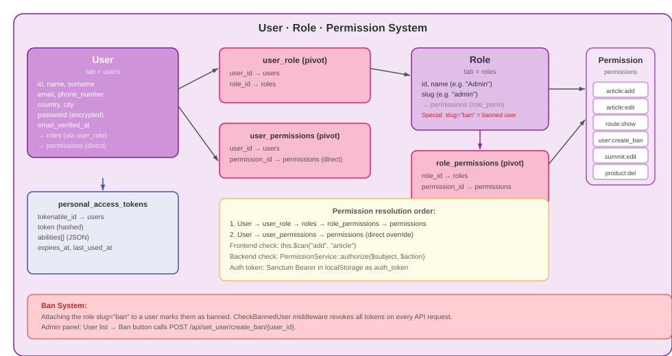
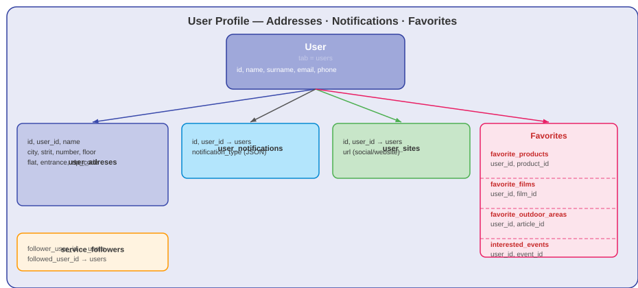
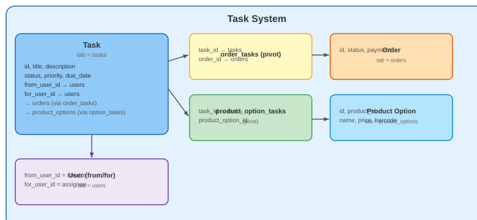

# User Dashboard & Admin CMS — user.climbing.ge

The unified user dashboard and content management system for all climbing.ge subdomains.

---

## Table of Contents

- [Overview](#overview)
- [Authentication Pages](#authentication-pages)
- [User Dashboard](#user-dashboard)
- [Admin CMS Sections](#admin-cms-sections)
- [Roles & Permissions](#roles--permissions)
- [Notifications & Queues](#notifications--queues)
- [Frontend Components](#frontend-components)
- [Backend API](#backend-api)

---

## Overview

**Subdomain:** `user.climbing.ge`  
**Root Component:** `resources/js/components/user/HomeComponent.vue`  
**Router:** `resources/js/routes/UserRoutes.js`  
**API base URL:** Authenticated routes under `/api/`

The user panel serves two audiences:
- **Regular users** — profile, orders, favorites, tour reservations, notifications
- **Admin/staff users** — full CMS for all subdomains (guide, shop, blog, summit, films)

---

## Authentication Pages

All authentication UI lives in `resources/js/components/auth/`:

| Component | Route | Description |
|---|---|---|
| `LoginComponent.vue` | `/login` | Email + password login |
| `RegisterComponent.vue` | `/register` | New user registration |
| `Verify.vue` | `/verify` | Email verification prompt |
| `ForgotPassword.vue` | `/forgot-password` | Request reset link |
| `ResetPassword.vue` | `/reset-password` | Set new password with token |

See [AUTH.md](AUTH.md) for full authentication flow and API details.

---

## User Dashboard

After login, authenticated users access their personal dashboard.

### Profile & Settings

- Edit name, surname, email, avatar, bio
- Change password
- Notification preferences (email alerts for events, new products, etc.)
- API: `POST /api/get_options/user_info_update/:user_id`

### Delivery Addresses

CRUD for saved delivery addresses used in shop checkout.

- API: `GET /api/get_user_adreses`, `POST /api/add_user_adreses`, `POST /api/edit_adres/:id`, `DELETE /api/del_user_adreses/:id`

### Orders

View past shop orders, order status, and download receipts.

### Favorites

- Favorite outdoor climbing areas
- Interested events
- Favorite films

### Tour Reservations

View and manage tour bookings placed through the shop.

---

## Admin CMS Sections

Admin users with appropriate roles see additional sections in the left menu.

### Guide Admin

Manage all content for `climbing.ge`:

| Section | What You Can Manage |
|---|---|
| **Articles** | Mount routes, outdoor spots, ice climbing, indoor, events, projects |
| **Sectors** | Sector data, images, local images for climbing spots |
| **Routes** | Climbing routes, grades, bolt counts, sector assignment, route topos |
| **Multi-pitch** | Multi-pitch route pitches |
| **Regions** | Outdoor climbing regions |
| **Mount Massifs** | Mountain massif groups |
| **Events** | Climbing competitions and events |
| **General Info** | Reusable info blocks (contacts, warnings) |
| **Sliders** | Hero image sliders per section |
| **Local Businesses** | Partner businesses linked to climbing areas |
| **Team Members** | Team/staff profiles |
| **Live Cameras** | Live webcam embeds |

### Shop Admin

Manage all content for `shop.climbing.ge`:

| Section | What You Can Manage |
|---|---|
| **Products** | Product catalogue with locale data, images, options |
| **Categories / Subcategories** | Product taxonomy |
| **Brands** | Product brands |
| **Orders** | Customer orders, status updates |
| **Custom Orders** | Manual/special orders |
| **Tours** | Multi-day guided tours |
| **Tour Categories** | Tour taxonomy |
| **Reservations** | Tour bookings |
| **Services** | Additional services offered |
| **Warehouses** | Inventory tracking |
| **Sale Codes** | Discount codes |
| **Shipping Regions** | Shipping zones + prices |

### Summit Admin

Manage all content for `summit.climbing.ge`:

| Section | What You Can Manage |
|---|---|
| **Summits** | Summit database — title, height, coordinates, QR code, publish status |
| **Ascents** | All ascent records across all summits |

See [SUMMIT.md](SUMMIT.md) for full summit admin documentation.

### Training Admin

Content management for the companion **climbing training mobile app** (fingerboard/campus/flexibility/strength/endurance workouts and multi-day coaching plans) — this repo is the CMS + public JSON API the app points at, there is no dedicated public subdomain for it.

| Section | What You Can Manage |
|---|---|
| **Trainings** | Individual exercises/workouts — global info incl. cover image, step-by-step breakdown, Georgian translation, compatible shop products |
| **Training Plans** | Multi-day coaching programs — global info, per-day sessions (which trainings run on which day), Georgian translation |

Left-menu visibility gated on `training`/`training_plan` `show` permission; a dedicated `training_creator` role exists for a trusted non-admin to manage content (`show`/`add`/`edit`, no `del`). Full detail: [TRAINING.md](TRAINING.md).

### Blog Admin

Create, edit, publish, and delete blog posts and news articles. Uses Quill rich-text editor.

### Films Admin

Manage film catalogue: add/edit/delete films, categories, and tags.

### User Management

Manage registered users:
- View all users, search, filter by role
- Edit user roles and permissions
- Ban/unban users (attaches/detaches the `ban` role) — reversible, keeps the account and its data
- **Permanently delete a user** — `DELETE /api/set_user/del_user/{user_id}` (requires `user:del`, added alongside the August 2026 registration fixes). Distinct from banning: this removes the `User_role`, `user_notification`, and `User_permission` rows and the account's uploaded image, then deletes the `User` row itself. An admin cannot delete their own account this way (`bulk_delete` has the same self-protection, filtering the acting admin's own id out of the `ids` array before deleting). Not reversible — no soft-delete.
- Reset user passwords

### Tasks

Internal task/todo system for staff. Tasks can be assigned to users with due dates, and organised by task categories.

### Multimedia Manager

Browse, upload, and delete images across all subdomains. The file tree shows which images are in use and which are orphaned.

### Database

View all database tables with row counts and detected integrity issues. Apply fixes directly from the UI.

### Notification Analytics

Charts and tables covering notification volume over time, breakdown by notification type and content type, per-preference adoption, and recent send activity. See [NOTIFICATIONS.md](NOTIFICATIONS.md).

### Export

Export guide articles by category to PDF.

---

## Roles & Permissions

### Backend (Custom Role/Permission Tables)

Roles and permissions stored in custom `roles`, `permissions`, `user_role`, `user_permissions`, `role_permissions` tables (not Spatie).




**Default roles:**

| Role | Description |
|---|---|
| `admin` | Full CMS access |
| `ban` | System role — having this role means the user is banned |
| `guide` | Shop tours management |
| `user` | Standard authenticated user |

**Permission columns:** `subject` + `action` (stored separately).  
Examples: `subject='article', action='add'` | `subject='summit', action='edit'` | `subject='user', action='create_ban'`

Use the **Sync Admin Permissions** button to assign all existing permissions to the admin role at once.

### User Profile, Addresses & Favorites



### Task System



### Frontend (CASL Vue)

Abilities are synced from `/api/auth_user` response on login.

```javascript
// Usage in templates
<button v-if="$can('add', 'summit')">Add Summit</button>
<router-link v-if="$can('edit', 'article')" :to="...">Edit</router-link>

// Usage in JavaScript
if (this.$ability.can('del', 'product')) { ... }
```

See [AUTH.md](AUTH.md) for full CASL setup.

---

## Notifications & Queues

### Email Queue

The platform uses Laravel Queues for sending bulk emails (event notifications, newsletter, etc.).

Queue configuration in `.env`:
```env
QUEUE_CONNECTION=database
```

Run queue worker:
```bash
php artisan queue:work                    # runs indefinitely
php artisan queue:work --queue=emails     # emails queue only
php artisan queue:work --timeout=60       # restart every 60s
php artisan horizon                       # Horizon dashboard
```

### Scheduled Notifications

Laravel Task Scheduling runs the event-reminder command daily.

```bash
php artisan schedule:work          # run scheduler locally
php artisan schedule:list          # list all scheduled tasks
php artisan send_event_notificatione:users  # run manually
```

Scheduler defined in `app/Console/Kernel.php`. Notification job: `app/Jobs/UserNotifications.php`.

Timezone: `Asia/Tbilisi` — set in `config/app.php`.

### User Notification Preferences

Each user has a `user_notifications` record (JSON preference blob) controlling which email types they receive. Managed at: `GET/POST /api/get_options/get_user_notification_data` and `/api/get_options/update_user_notification_data`.

### Automatic New-Content Notifications

Publishing new content in the guide, shop, blog, summit, or films domains automatically emails subscribed users — no admin action required. Sends are deduplicated via `content_notification_logs` so nothing is ever emailed twice. See [NOTIFICATIONS.md](NOTIFICATIONS.md) for the full architecture (resolvers, observers, dedup log, the analytics dashboard).

---

## Frontend Components

### Layout Components (`resources/js/components/user/items/`)

| Component | Description |
|---|---|
| `BreadcrumbComponent.vue` | Breadcrumb navigation bar |
| `LeftMenuComponent.vue` | Left sidebar navigation |
| `NavbarComponent.vue` | Top navigation bar |
| `FooterComponent.vue` | Footer |

### Data Table System (`items/data_table/`)

The admin panel uses a generic tabbed data table system. See [FRONTEND/USER_PANEL_TABLE.md](FRONTEND/USER_PANEL_TABLE.md) for full documentation.

**Components:**
- `TabsComponent.vue` — Main wrapper with tabs, search, pagination
- `TabHeaderComponent.vue` — Table `<thead>` renderer
- `TabBodyComponent.vue` — Table `<tbody>` with action buttons
- `DataComponent.vue` — Cell value renderer (supports bool icons, nested fields)
- `FilterComponent.vue` — Dropdown filter
- `PaginationComponent.vue` — Page navigation
- `SearchComponent.vue` — Text search

### Modals (`items/modal/`)

| Component | Description |
|---|---|
| `StackModal.vue` | Generic reusable modal (see FRONTEND/STACK_MODAL.md) |
| `ArticleQuickViewModal.vue` | Quick preview for guide articles |
| `tab_modals/SectorModalComponent.vue` | Sector route management |
| `tab_modals/ArticleSectorSequenceModalComponent.vue` | Sector ordering |

### Form Editors (`items/form/parts/editor/`)

Three globally registered Quill-based rich text editors:

| Name | Component | Use |
|---|---|---|
| `big_editor` | `BigEditorComponent.vue` | Full-featured: text, images, tables |
| `small_editor` | `SmallEditorComponent.vue` | Basic text formatting |
| `mini_editor` | `MiniEditorComponent.vue` | Single-line rich text |

---

## Backend API

### User Data Routes (`routes/api/get_user_routes.php`)

All routes behind `auth:sanctum` + `banned` middleware.

**User:**

| Method | Path | Description |
|---|---|---|
| GET | `/api/auth_user` | Current user + abilities |
| GET | `/api/get_user/get_auth_user_data` | Detailed user data |
| GET | `/api/get_user/get_user_data/:user_id` | Another user's data (admin lookup) |
| GET | `/api/get_user/get_all_users` | All users (admin) |
| GET | `/api/get_user/get_worker_users` | Users with a staff-capable role, for assignment dropdowns (e.g. task assignee) |
| GET | `/api/get_user/get_auth_user_permissions` | User's permissions array |
| GET | `/api/get_user/post_user/:user_id` | *(controller method `get_post_user` — route path doesn't match the method name)* |
| GET | `/api/get_user/get_team/get_member_status/:id` / `get_team_members` | Team-member lookups scoped under the authenticated-user namespace, distinct from the public guide team endpoints |
| POST | `/api/user/user_image_update/:user_id` | Upload/replace avatar |
| POST | `/api/user/update_password` | Change own password |
| GET/POST/PUT/DELETE | `/api/user_site` (`Route::apiResource`) | CRUD for the profile's external links list (`user_sites` table, `id`+`url`+`user_id`) — the `user_sites` shown on the public [Climber Profile](CLIMBER_PROFILE.md#backend-api) |
| GET | `/api/get_options/get_selected_user_data/:user_id` | Admin: load one user's editable profile data |
| GET | `/api/get_options/get_user_notification_data` | Current user's notification-preference blob |
| POST | `/api/get_options/user_info_update/:user_id` | Update profile |
| POST | `/api/get_options/update_user_notification_data` | Update notifications |

**Addresses:**

| Method | Path | Description |
|---|---|---|
| GET | `/api/get_user_adreses` | All saved addresses |
| GET | `/api/get_activ_adres/:id` | The one address currently marked active/default |
| POST | `/api/get_editing_adres/:id` | Load one address for editing (POST despite being a read, per this controller's existing convention) |
| POST | `/api/add_user_adreses` | Add address |
| POST | `/api/edit_adres/:id` | Edit address |
| DELETE | `/api/del_user_adreses/:id` | Delete address |

**Favorites:**

| Method | Path | Description |
|---|---|---|
| GET | `/api/get_faworite/get_faworite_outdoor_region` | Favorite areas |
| GET | `/api/get_faworite/get_interested_events` | Interested events |
| GET | `/api/get_faworite/check_interested_status/:event_id` | Is the current user interested in this event? |
| GET | `/api/get_faworite/check_favorite_status/:article_id` | Has the current user favorited this outdoor area? |
| POST | `/api/set_faworite_by_user/add_to_favorite_outdoor_area/:id` | Add favorite |
| POST | `/api/set_faworite_by_user/add_to_interested_events` | Mark interested in an event |
| DELETE | `/api/set_faworite/del_favorite_outdoor_area/:id` | Remove favorite |
| DELETE | `/api/set_faworite/del_interested_event/:id` | Remove interest |

**Climber follow (climber-to-climber, not the legacy shop/guide "service following"):**

| Method | Path | Description |
|---|---|---|
| POST | `/api/set_user_follow/follow/{user_id}` | Follow another climber |
| DELETE | `/api/set_user_follow/unfollow/{user_id}` | Unfollow |
| GET | `/api/set_user_follow/follow_status/{user_id}` | `{ following, is_self }` |

Full writeup — social graph, activity-email notifications, and the two other similarly-named-but-unrelated "follow" models this can be confused with — in [CLIMBER_PROFILE.md](CLIMBER_PROFILE.md#the-follow-system).

---

[Go back](../README.md)
